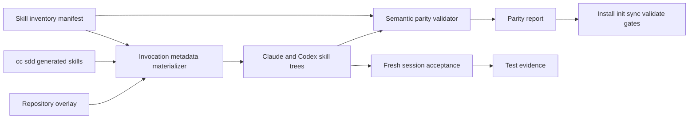
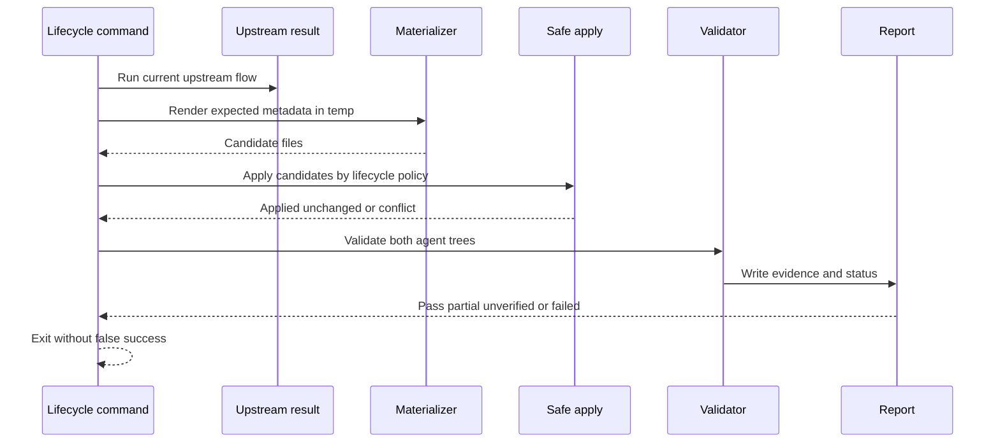
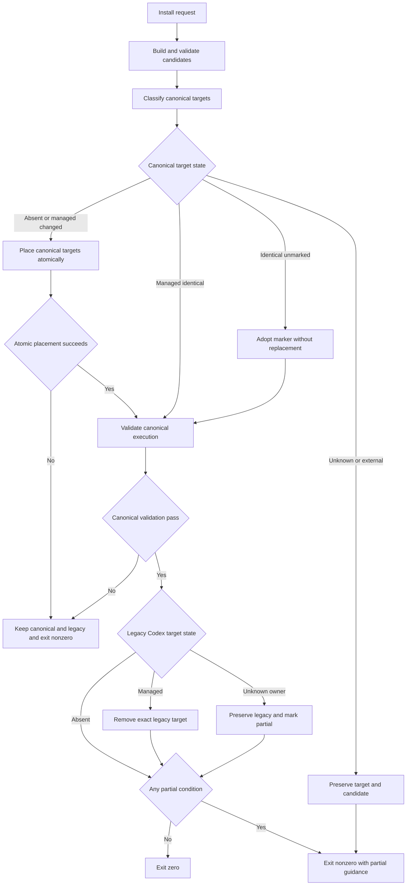

# Design Document: Claude Code / Codex SDDスキルパリティ

## Overview

本機能は、`sdd_base_template`が配布するSDDスキルをClaude CodeとCodexの双方で検出・起動でき、
同じ成果物・承認ゲート・停止条件を使える状態にする。配布ファイル数の一致ではなく、正規インベントリ、
プラットフォーム固有metadata、意味的検証、ライフサイクルのfail-closed判定、新規セッションの証跡を
一つの契約として扱う。

既存のcc-sdd実行、overlay、safe apply、自己完結型`sdd-init` bundleを維持する。新規の正本は
repo-owned manifestだけであり、cc-sddのソースまたは生成物を`payload/`へ再配布しない。

### Goals

- 全`kiro-*`、`doc-export`、個人向け`sdd-init`の分類と明示／暗黙起動方針を一意にする。
- Codex公式schemaのmetadataと標準探索scopeを使い、Claude Codeと意味的に同等な入口を配布する。
- init、sync、validate、installで不完全なパリティを成功扱いしない。
- 静的検査と新規セッションE2Eを分離し、失敗段階とsource/scopeを追跡可能にする。

### Non-Goals

- Issue #30のsync競合解決方式、Issue #31の実行通知を変更しない。
- Issue #39の独立レビュアー実装、自動approval廃止、fallback廃止を先取りしない。
- cc-sddバージョンを昇格せず、cc-sdd生成物を`payload/`へ同梱しない。
- 各`kiro-*`の業務ロジックを全面改修しない。
- 静的検査だけで実際のselectorやモデル起動を証明したことにしない。

## Boundary Commitments

### This Spec Owns

- 配布スキルの正規インベントリ、user-facing/helper分類、暗黙起動方針。
- Codex向け`agents/openai.yaml`の生成・検証契約。
- Claude Code/Codex間の意味的パリティ検査と機械可読レポート。
- install、init、sync、validateへパリティ判定を伝播する境界。
- 個人向け`sdd-init`の標準scope移行と安全な旧配置処理。
- 両環境の実際の起動方法と、新規セッション受入手順。

### Out of Boundary

- syncの三方マージ、`.new`内容、更新履歴の一般契約はIssue #30が所有する。
- skill実行前後の通知はIssue #31が所有する。
- 独立レビューの強制、review hash、自動approval/fallbackはIssue #39が所有する。
- cc-sdd版の検証・昇格はIssue #33以降が所有する。
- `cyclox2_docker`固有の製品変更は行わず、反映後の受入だけを行う。

### Allowed Dependencies

- Node.js 18標準API、POSIX shell、既存`payload/scripts/sync_lib/{hash,lock,merge}.sh`。
- `sync.sh`の既存`sdd_apply_file`とlock/snapshot機構。
- 新しい共通shell helperは前提にせず、parity固有ロジックは自己完結したNode CLI、sync固有処理は
  既存`sync_lib`と`sdd_apply_file`の境界に置く。
- cc-sddの実行結果。ただしpayloadへの再配布は禁止する。
- Claude CodeとCodexの各スキル探索機能。静的validatorはそれらの内部実装へ依存しない。

### Revalidation Triggers

- Codexのskill discovery scope、`agents/openai.yaml` schema、明示起動構文の変更。
- cc-sddが生成するスキル集合、frontmatter、AGENTS案内の変更。
- manifestの分類、暗黙起動方針、主要契約、許容差の変更。
- install先、init/syncの適用順、validator終了コードの変更。
- Issue #39による安全契約更新。#32の意味的検証対象も同時に再確認する。

## Architecture

### Existing Architecture Analysis

- `bin/cli.js install`は`sdd-init`と`payload`の自己完結bundleを個人scopeへcopy/linkする。
- `init.sh`はcc-sddのClaude/Codex生成後にpatch、overlay、post validationを行う。
- `sync.sh`はupstream再生成結果を既存のsafe applyで対象リポジトリへ反映する。
- `validate.sh`はpre/postを持つが、現在は名前集合やバイト差中心で、実起動契約を表現しない。
- `.claude/skills`と`.agents/skills`は本文の意味を揃えつつ、Codex側だけに固有metadataを持てる。

### Architecture Pattern & Boundary Map

採用するのは、単一manifestを正本にした「materialize then validate」パターンである。生成と検査は同じ
manifestを読むが、validatorは生成物を再計算して比較するだけで、自動修復はしない。materializerは
Codex `openai.yaml`だけでなく、Claude/Codex別の`SKILL.md` invocation frontmatterとhelper guardも扱う。



**Architecture Integration**

- Selected pattern: manifest-driven materialization and independent semantic validation。
- Domain boundaries: policy、materialization、static validation、lifecycle integration、live acceptanceを分離する。
- Existing patterns preserved: cc-sdd実行、overlay、safe apply、bash test runner、自己完結bundle。
- New components rationale: 分散した起動方針を正本化し、意図した差と欠陥を機械的に区別するため。
- Steering compliance: Claude/Codex同一変更、main直接commit禁止、TDD、fail-closedを維持する。

### Technology Stack

| Layer | Choice / Version | Role in Feature | Notes |
|---|---|---|---|
| CLI | Node.js 18+ | manifest、metadata生成、validator、JSON report | 外部dependencyなし |
| Lifecycle | Bash | init/sync/validateとの統合、既存safe apply | POSIX互換を維持 |
| Policy data | JSON schema version 1 | 正規インベントリと許容差 | repo-owned |
| Metadata | `SKILL.md` YAML frontmatter、Codex `agents/openai.yaml` | discoveryと起動方針 | 公式schemaのsubset |
| Tests | Bash test runner + fixture temp dirs | unit/integration | `tests/`のみ |
| Live acceptance | Claude Code/Codex新規セッション | selectorと実起動の確認 | 自動化不能項目は手動証跡必須 |

## File Structure Plan

### New Files

```text
payload/
├── scripts/
│   └── skill-parity.js                         # manifest生成 検証 report CLI
├── validation/
│   ├── skill-parity.json                       # 正規インベントリと許容差の正本
│   ├── skill-session-evidence.schema.json       # live session証跡の機械可読schema
│   ├── templates/
│   │   └── skill-session-acceptance.md          # 新規セッション受入手順
│   └── patches/
│       └── fix-codex-agent-guidance.sh         # 既知の廃止設定案内だけを置換
└── overlay/skills/doc-export/agents/
    └── openai.yaml                             # overlay由来doc-exportのCodex metadata
skills/sdd-init/
└── agents/openai.yaml                          # 個人向けsdd-initのCodex metadata
tests/
├── fixtures/skill-parity/
│   ├── minimal-home/                           # scopeを隔離したagent home fixture
│   └── probe-repo/                             # harmless canary skillと承認停止fixture
├── unit/test_skill_parity.sh                   # manifest parser generator validator集約
└── integration/
    ├── test_skill_parity_lifecycle.sh          # init sync validate fail closed
    └── test_install_skill_targets.sh           # copy link 旧scope移行
```

### Generated Repository Files

- `.agents/skills/*/agents/openai.yaml` — manifestから生成するCodex固有metadata。
- `.claude/skills/*/SKILL.md` / `.agents/skills/*/SKILL.md` — 本文を維持しつつ、manifestから
  agent別invocation frontmatterとhelper guardをmaterializeする。
- `.agents/skills/doc-export/agents/openai.yaml` — overlay適用結果。
- `.claude/skills/doc-export/agents/openai.yaml` — overlayの同一資産。Claudeが無視しても意味的差にはしない。

### Modified Files

- `bin/cli.js` — 個人install先、管理marker、旧Codex scopeの安全な移行、終了状態。
- `scripts/install.sh` — CLIと同じ正規scope・移行契約へ揃える。
- `skills/sdd-init/SKILL.md` — Claude/Codex探索先と起動案内を更新する。
- `payload/scripts/init.sh` — metadata materialization、strict patch、post validationをfail-closedにする。
- `payload/scripts/sync.sh` — temp生成物を既存`sdd_apply_file`で安全適用し、parity状態を集約する。
- `payload/scripts/validate.sh` — semantic validatorをpre/postの正規検査として呼ぶ。
- `payload/validation/checks.md` — バイト一致から意味的検証・live acceptanceへ説明を更新する。
- `payload/validation/known-parity-diffs.txt` — 必要な既知差だけをmanifestと整合させる。
- `payload/overlay/gitignore.snippet` — local parity reportをgit管理外にする。
- `README.md` — Claude、Codex、自然言語の入口と明示専用スキルを併記する。
- `AGENTS.md` / `CLAUDE.md` — 個人install先と意味的整合確認を同一内容で更新する。
- `payload/overlay/snippets/AGENTS.sdd.md` / `CLAUDE.sdd.md` — 配布先規約を同一内容で更新する。

`package.json`へruntime dependencyは追加しない。テスト実装は`payload/`へ置かない。

## System Flows

### Init and Sync Materialization



**Init phase contract**

| State | Materialization | Validation | Result |
|---|---|---|---|
| `fresh` | cc-sdd生成後、repo-owned candidateを直接配置 | preはupstream由来skill集合、postは全manifest | post非PASSなら失敗 |
| `keep` + missing | candidateを配置 | postは全manifest | 適用済みとして検査 |
| `keep` + identical | no-op | postは全manifest | 通常検査 |
| `keep` + differing existing | 元を保持し完全候補を`.new`へ出す | 対象はPARTIAL | 完了宣言しない |
| `overwrite` | cc-sdd backup規約に従い、repo-owned候補もbackup後に置換 | postは全manifest | 明示選択された上書きだけ許可 |
| `compare` | 実treeを変更せずtemp候補だけ生成 | candidateを検査し、実treeはUNVERIFIED | 差分表示の完了と導入完了を区別 |

preはoverlay前に存在できる`origin=upstream`のskillと必須frontmatterだけを検査する。postだけが
`doc-export`を含む全manifest、metadata、assets、contract assertionsを要求する。phase別期待集合は
manifestの`origin`から導出し、preにpost条件を誤適用しない。

**Sync state contract**

| Lock state / target state | Apply rule | Lock and snapshot rule | Status |
|---|---|---|---|
| no lock / target absent | parity candidateを作成 | 実適用後のhashとcandidateを記録 | applied |
| no lock / target identical | no-opで管理対象へ採用 | 現状hashとcandidateを記録 | adopted |
| no lock / target differs | 元を保持し`.new`へ完全候補 | 対象entryを作らない | PARTIAL |
| existing lock / new target absent | candidateを作成 | 実適用後だけentry追加 | applied |
| existing lock / new target identical | no-opで管理対象へ採用 | 現状hashでentry追加 | adopted |
| existing lock / new target differs | 所有不明として元を保持し`.new` | entryを追加しない | PARTIAL |
| existing lock / managed unchanged | candidateを適用 | 適用後hashとsnapshotを更新 | updated |
| existing lock / managed changed | 既存`sdd_apply_file`で三方merge | clean適用時だけ更新 | merged or PARTIAL |
| existing lock / conflict | 元を保持し`.new`へ完全候補 | lockとsnapshotを更新しない | PARTIAL |

lockなしsyncは、従来管理対象の基準点を採取した後、parity manifestの新規管理対象だけを上表で
同一実行中に適用する。これにより初回syncが基準点作成だけで終わらず、#32の新規metadataを一回で
修復できる。既存管理対象のmerge判断は変更しない。lock/snapshotへ記録するのは実適用または
identicalとして採用した資産だけで、`.new`候補を新しいbaseとして記録しない。

post validationが`PASS`以外なら、initは成功表示をせず非0、syncは完全適用成功と区別する。

### Personal Install Migration



候補bundleは一時領域で完成・検証してから、target単位で置換する。canonicalとlegacyの双方を
次の状態へ分類し、名前一致だけで削除しない。

| Target state | Canonical target | Legacy target |
|---|---|---|
| absent | 検証済み候補を配置 | no-op |
| managed-current | identicalならno-op、変更時はatomic replace | canonical PASS後に除去可 |
| managed-old | 検証済み候補へatomic upgrade | canonical PASS後に除去可 |
| identical-unmarked | 内容を保持しmarkerだけ付与してadopt | 所有不明として保持しPARTIAL |
| unknown-owner | 上書きせず`sdd-init.new`候補を残す | 保持しPARTIAL |
| broken-or-external-symlink | 変更せずPARTIAL | 変更せずPARTIAL |

`managed-*`はmarkerのtool IDとschema、またはlink componentが現install sourceへ解決することでのみ
成立する。canonical targetの置換前には同じparent内で候補を完成し、rename可能な単位にする。
置換またはcanonical実行validationに失敗した場合は旧targetを保持し、半完成のtargetを公開しない。
parity検査がPASSでもunknown-owner等を保存した場合は、集約結果を`PARTIAL`から`PASS`へ昇格させない。
canonicalがunknown-ownerまたはbroken-or-external-symlinkなら、元targetとlegacyの双方を変更せず、
候補または診断を残して`PARTIAL`終了する。atomic placementへ進めるのはabsentまたはmanagedなtargetだけで、
identical-unmarkedは内容を置換せずmarkerだけを追加する。

### New Session Acceptance

初期一覧、selector、明示、暗黙、処理開始は独立したstageとして記録する。初期一覧の省略だけでは
failureにせず、selectorと明示起動を続ける。対象repo由来のsource/scope/path/enabledを確認できない
場合は、そのスキルを合格にしない。

## Data Models

### Skill Inventory Manifest

```json
{
  "schema_version": 1,
  "skills": [
    {
      "name": "kiro-spec-design",
      "scope": "repository",
      "origin": "upstream",
      "role": "user-facing",
      "implicit_invocation": true,
      "interface": {
        "display_name": "Kiro Spec Design",
        "short_description": "Create an approved technical design from requirements",
        "default_prompt": "Use $kiro-spec-design to create the design for this spec."
      },
      "phases": ["design"],
      "required_assets": ["SKILL.md"],
      "required_contracts": ["human-approval", "implementation-stop"]
    }
  ],
  "contracts": {
    "implementation-stop": {
      "assertions": [
        {
          "agent": "both",
          "skills": ["kiro-spec-design"],
          "path": "SKILL.md",
          "kind": "anchored-section",
          "anchor": "## Approval Gate",
          "required": ["human approval"],
          "forbidden": ["auto approve"],
          "failure_code": "CONTRACT_IMPLEMENTATION_STOP_CHANGED"
        }
      ]
    }
  },
  "allowed_platform_differences": [],
  "deprecated_guidance": []
}
```

**Invariants**

- `name`は全scopeを通じた正規名で、同一scope内で一意。
- repository inventoryには現存する全`kiro-*`と`doc-export`を漏れなく含める。
- personal inventoryには`sdd-init`を含める。
- `role=user-facing`は両環境の明示入口を必須とする。
- `interface.short_description`は25〜64文字、`default_prompt`は`$<name>`を含む。
- `origin=upstream|overlay|personal`を必須とし、pre/postの期待集合を決定する。
- 未分類、根拠なし許容差、未知の必須契約はvalidation failure。

### Contract Assertion Model

`required_contracts`は単なるラベルではなく、manifestの`contracts`に存在する検査定義を参照する。
各assertionは`agent`、`skills`、`path`、`kind`、`anchor`またはfrontmatter key、`required`、
`forbidden`、`failure_code`を必須とする。利用できる`kind`は次に限定する。

| Kind | 判定 |
|---|---|
| `frontmatter-equals` | agent別frontmatter keyが期待値と一致 |
| `anchored-section` | 一意な見出しまたは管理marker内で必須句が存在し、禁止句が存在しない |
| `normalized-section-hash` | 承認済みbaselineの対象節を改行・末尾空白だけ正規化してhash比較 |
| `delegation-reference` | parent skillの指定節から正規helper名への委譲が存在 |
| `paired-artifact-equals` | agent別正本の指定範囲が同一、または許容差定義と一致 |

安全契約は単一語の存在だけで合格にしない。approval、TDD、review、implementation-stopは
`anchored-section`の必須・禁止assertionと`normalized-section-hash`のbaselineを組み合わせる。
baseline hashは実装着手時の承認済みrequirementsに対応する現行skill節から作り、manifest変更として
review対象にする。自動approval、同一context fallback、実装開始条件を示す禁止assertionも持つ。

**Agent-specific invocation mapping**

| Classification | Claude Code | Codex | Negative acceptance |
|---|---|---|---|
| implicit-enabled | `disable-model-invocation`なし | `allow_implicit_invocation: true` | 対応する自然言語で開始 |
| explicit-only | `disable-model-invocation: true` | `allow_implicit_invocation: false` | 自然言語だけでは処理を開始せず明示方法を案内 |
| internal/helper | `user-invocable: false`と`disable-model-invocation: true`、parentが既知pathの本文を参照 | `allow_implicit_invocation: false`、直接起動guard、parentの構造化委譲 | 直接入口では実処理を開始せず、parent flowだけがguardを満たす |

Claude固有frontmatterとCodex固有`openai.yaml`は、同じ分類を実現する理由付き許容差である。
Codexにはhelperをselectorから隠す現行公式contractがないため、selector非表示を合格条件にしない。
表示されたhelperを利用者が直接起動した場合も、guardが親skillの利用を案内して停止すれば合格とする。

**Helper delegation contract**

- parent skillはmanifestの`delegates`に定義されたhelperだけを利用できる。
- Claude parentは配布先rootから解決したhelper `SKILL.md`を読み、`SDD_HELPER_DELEGATION` blockを
  含む依頼として本文手順を実行する。Skill selector経由では起動しない。
- Codex parentは正規`$helper-name`を明示し、同じdelegation blockを渡す。
- delegation blockは`parent_skill`、`helper_skill`、`spec_id`または`task_id`、`purpose`を必須とする。
- helper guardはblock欠落、parent/helper不一致、manifestにない組合せを`HELPER_DIRECT_INVOCATION`として
  停止し、成果物・approval・実装状態を変更しない。
- これは敵対的利用者に対する認証ではなく、SDD入口の誤起動防止契約である。selector可視性や
  秘密tokenを安全性根拠にしない。

### Parity Report

```json
{
  "schema_version": 1,
  "run_id": "timestamp-random",
  "started_at": "RFC3339",
  "status": "PASS",
  "phase": "post",
  "targets": [],
  "summary": {
    "skills": 19,
    "agents": ["claude-code", "codex"],
    "checks": ["inventory", "frontmatter", "metadata", "assets", "contracts"]
  },
  "findings": []
}
```

各findingは`code`、`status`、`agent`、`scope`、`skill`、`stage`、`expected`、`actual`、
`source_path`、`evidence`を持つ。live acceptance追記では`start_location`、`session_id`、`enabled`、
`selected_source`、`result`を必須にする。毎回新しい`run_id`を使い、前回証跡へ上書き混同しない。

### Status and Exit Contract

| Status | Meaning | Exit |
|---|---|---|
| `PASS` | 必須検査がすべて成功 | 0 |
| `PARTIAL` | 一部適用、競合、所有不明旧配置等 | 2 |
| `UNVERIFIED` | 実行不能、証跡不足、未知形式 | 2 |
| `FAILED` | 契約違反または内部エラー | 1 |

複数結果は`FAILED > UNVERIFIED > PARTIAL > PASS`の優先順位で集約する。

## Components and Interfaces

| Component | Layer | Intent | Requirement Coverage | Dependencies | Contract |
|---|---|---|---|---|---|
| SkillInventoryManifest | Policy | 対象と起動方針の正本 | 1, 3, 4, 5, 7, 11, 12 | JSON | State |
| InvocationMetadataMaterializer | Build | agent別frontmatter、helper guard、Codex metadataを決定的に生成 | 2, 3, 7, 8, 12 | Manifest | Batch |
| SemanticParityValidator | Validation | 両agentの意味的契約を検査 | 1, 2, 4, 5, 7, 8, 10, 11, 12 | Manifest, skill trees | Service Batch |
| LifecycleGateAdapter | Integration | init sync validateへ状態を伝播 | 5, 7, 8, 10, 11 | Existing scripts | Batch |
| PersonalSkillInstaller | Distribution | sdd-initを標準scopeへ安全配布 | 6, 10, 12 | bin CLI, bundle | Batch State |
| GuidanceOverlay | Documentation | 実在する入口と廃止設定修正を配布 | 3, 4, 6, 8, 11, 12 | README, snippets, patch | State |
| SessionAcceptanceHarness | Acceptance | 実selectorと起動の証跡を定義 | 2, 3, 4, 5, 6, 9, 10, 12 | Fresh sessions | Batch |

### Policy and Materialization

#### SkillInventoryManifest

**Responsibilities & Constraints**

- 全配布スキルの分類、暗黙起動、Codex interface、必須資産・契約、許容差を所有する。
- upstreamとtreeの両方から検出された正規名がmanifestと一致するまで合格にしない。
- 安全契約の本文そのものを複製せず、契約IDごとに対象、anchor、必須・禁止assertion、baseline hash、
  failure codeを定義する。

#### InvocationMetadataMaterializer

**Batch Contract**

```text
node payload/scripts/skill-parity.js materialize-repo \
  --root <target-repo> --payload <payload-dir> \
  --policy <fresh|keep|stage> [--stage-dir <dir>]
```

- `fresh`: expected filesを直接配置する。
- `keep`: missingだけ配置し、不一致は`<path>.new`へ完全候補を出して`PARTIAL`。
- `stage`: targetを変更せず、safe apply用候補を`stage-dir`へ生成する。
- 生成順、key順、改行、引用を固定し、同じmanifestから同じbytesを作る。
- `SKILL.md`本文の非管理領域は維持し、frontmatterの管理keyとhelper guard marker blockだけを更新する。
- Claudeのinvocation key、Codexのpolicy、helper guardの差はmanifestのagent別mappingから生成する。
- overlayで同一補助ファイルが両treeへ入る場合は、agentが無視できる資産として許容する。

### Validation and Lifecycle

#### SemanticParityValidator

**Service Contract**

```text
node payload/scripts/skill-parity.js validate-repo \
  --root <target-repo> --payload <payload-dir> --phase <pre|post> \
  --report <target-repo>/.kiro/sdd-skill-parity-report.json

node payload/scripts/skill-parity.js validate-personal \
  --claude-target <path> --codex-target <path> --legacy-target <path>
```

**Validation order**

1. manifest schemaと正規名の一意性。
2. Claude/Codex treeとmanifestの集合一致。
3. `SKILL.md` frontmatterのname、description、folder名。
4. Claude/Codex `SKILL.md`のagent別invocation frontmatterとhelper guard。
5. Codex `agents/openai.yaml`のinterface、policy、default prompt。
6. role、agent別explicit/implicit/helper mapping、delegation、必須資産、contract assertions。
7. 許容差とdeprecated guidance。
8. report writeとstatus集約。

検査中に自動修復しない。ファイル欠落と未対応構文を区別し、対象agent、scope、skill、stageを
findingへ含める。

#### LifecycleGateAdapter

- `validate.sh pre|post`はvalidatorの終了コードをそのまま呼出元へ返す。
- `init.sh`はpost validationの`|| true`を廃止し、非PASS時は完了表示せずreport pathを示す。
- `sync.sh`はmaterialize `stage`の候補を`sdd_apply_file`へ渡し、競合なら元ファイルを保持する。
- syncの一般終了契約はIssue #30と統合可能なように、parity statusを独立変数・report sectionで返す。
- release/E2Eはstatic reportとfresh-session evidenceの双方が`PASS`でなければ合格宣言しない。

### Distribution and Guidance

#### PersonalSkillInstaller

**Canonical targets**

| Agent | Target |
|---|---|
| Claude Code | `$HOME/.claude/skills/sdd-init` |
| Codex | `$HOME/.agents/skills/sdd-init` |

copy modeの候補bundleは`SKILL.md`、`agents/openai.yaml`、`payload/`の実コピーと
`.sdd-base-managed.json`を持つ。link modeのcanonical targetはmarkerを持つ実ディレクトリとし、
内部の`SKILL.md`、`agents/`、`payload/`をそれぞれrepository sourceへsymlinkする。これにより
`SKILL.md`から見た`./payload/scripts/init.sh`はcopy/linkの双方で同じ相対pathへ解決する。

markerはtool ID、schema version、install mode、source package version、link source absolute pathを
記録する。link sourceが移動・欠落・repository外へ変化した場合はbroken-or-externalとして
自動置換しない。旧`$HOME/.codex/skills/sdd-init`はmanagedが証明でき、かつ新canonical targetの
実行validationがPASSした場合だけ削除する。unknown ownerは保存して`PARTIAL`と手動確認手順を返す。

#### GuidanceOverlay

- READMEはClaude `/kiro-*`、Codex `$kiro-*`と`/skills`、自然言語入口を同じフェーズ表で示す。
- 暗黙起動不可のuser-facingスキルは明示方法と理由を示す。
- AGENTS/CLAUDE pairと配布snippet pairは同一内容を維持する。
- `diff -qr`を全体合否に使わず、semantic validator commandを正規検査として案内する。
- deprecated guidance patchは完全一致した既知blockだけを置換する。未知形状は変更しない。

### Acceptance

#### SessionAcceptanceHarness

`payload/validation/templates/skill-session-acceptance.md`を配布手順の正本、
`payload/validation/skill-session-evidence.schema.json`を証跡形式の正本とする。実セッションを
偽装せず、CLIまたはDesktopの新規セッションで各stageを実行し、specの
`integration-test-checklist.md`へrun IDとevidence fileを記録する。

**Matrix**

| Dimension | Required values |
|---|---|
| Agent | Claude Code, Codex |
| Distribution | init直後, sync直後, `cyclox2_docker`反映後 |
| Codex start | repo root, repository subdirectory |
| Codex scope load | minimal skills, normal user/system/plugin skills |
| Stage | initial list, selector, explicit, implicit where allowed, processing start |
| Flow | requirements, design, tasks, implementation stop, validation |

Requirement 2の代表9スキルはCodexでselector、正規名明示、処理開始を各々確認する。既存セッションの
再利用だけではdiscovery変更の受入を完了しない。manual項目が未実施ならstatusは`UNVERIFIED`である。

**Evidence acquisition**

1. `tests/fixtures/skill-parity/minimal-home`を一時HOMEへcopyし、user/pluginの同名skillがない状態を作る。
2. `probe-repo`へrepo scopeとuser scopeで同名だが異なるcanary IDを持つharmless skillを配置する。
3. selectorの表示名、明示起動時に返すcanary ID、開始cwd、実ファイルのhashを記録し、source/pathを確定する。
4. Codexの`enabled`は一時HOMEの`.codex/config.toml`とselector結果を対応付ける。Claudeは
   frontmatterの`user-invocable` / `disable-model-invocation`とselector結果を対応付ける。
5. 実repo skillの処理開始はtemp repo/specで行い、成果物または安全停止メッセージと対象skill名を記録する。
6. normal環境では秘密値を保存せず、scope、path、config entryのhash、結果だけを証跡にする。

**Required negative probes**

| Probe | Expected result |
|---|---|
| duplicate same-name at repo and user scope | 対象sourceを識別できなければUNVERIFIED、wrong canaryならFAILED |
| Codex disabled skill | selector/explicitでdisabledを確認し、enabledとしてPASSしない |
| wrong-source selection | `WRONG_SOURCE_SELECTED`でFAILED |
| ambiguous natural-language intent | 処理開始せず確認または明示方法を示してPASS |
| explicit-only skill by natural language | 処理開始せず明示構文を示してPASS |
| helper direct route | Claudeはselector経由で起動不能、Codexは表示有無に依存せずguard停止。parent delegationだけが実処理 |
| processing-start failure after selection | `PROCESSING_START_FAILED`でFAILED |

probeは外部通信、git write、本番データ、approval変更を行わず、canary文字列を返すだけにする。
`kiro-impl`の実skill確認は未承認fixture specを用い、実装を開始せず承認停止することを成功条件にする。

## Error Handling

| Condition | Code | Status | Required action |
|---|---|---|---|
| manifestに未分類skill | `INVENTORY_UNCLASSIFIED` | FAILED | manifestを人間判断で更新 |
| frontmatter不正 | `FRONTMATTER_INVALID` | FAILED | 対象skillを修正 |
| Codex metadata不正 | `OPENAI_METADATA_INVALID` | FAILED | materialize結果とmanifestを確認 |
| 同名source曖昧 | `SOURCE_AMBIGUOUS` | UNVERIFIED | scopeとdisable設定を整理 |
| sync競合 | `SKILL_ASSET_CONFLICT` | PARTIAL | `.new`を手動確認。解決方式は#30 |
| 旧個人scope所有不明 | `LEGACY_TARGET_UNKNOWN_OWNER` | PARTIAL | userが内容を確認して移行 |
| live session未実施 | `SESSION_EVIDENCE_MISSING` | UNVERIFIED | 新規セッション受入を実施 |
| 実処理開始失敗 | `PROCESSING_START_FAILED` | FAILED | agent、skill、source、stageを診断 |

## Testing Strategy

### TDD Order

1. manifest/schema、限定YAML parser、metadata renderer、status集約の失敗テストを先に追加する。
2. static validatorの正常系・欠落・重複・許容差・安全契約回帰テストを追加する。
3. install targetとlegacy ownershipのintegration testを先に追加する。
4. init/sync/validateの非PASS伝播、keep/stage、競合保持のintegration testを先に追加する。
5. docs/patch/static reportのcontract testを追加する。
6. 実セッションmatrixを手動実施し、specの`test-results.md`と
   `integration-test-checklist.md`へrun ID付きで記録する。

### Required Test Cases

- 全19対象（repo 18 + personal 1）が一意に分類される。
- official interface schema、25〜64文字説明、`$name`入りpromptを生成・検査する。
- missing、duplicate、wrong folder/name、unknown YAML、root/subdirectory探索条件を区別する。
- helper、explicit-only、implicit-enabledを期待どおり判定する。
- Claudeの`disable-model-invocation` / `user-invocable`とCodex policyの分類対応を判定する。
- helperのguard、許可parent集合、delegation blockを検査し、直接起動では副作用がないことを確認する。
- approval、TDD、review、implementation-stopの既存契約が両treeで維持される。
- init post failureが成功表示・exit 0にならない。
- sync競合時に元ファイルを保持し、候補とparity partialを報告する。
- install copy/linkが`.claude`と`.agents`へ配布され、managedな旧targetだけを除去する。
- canonical/legacyの6状態を網羅し、unknown targetを保持し、link bundleから実際のinit開始まで確認する。
- README、AGENTS/CLAUDE、snippet pairの起動表記とsemantic commandが一致する。
- `bash tests/run.sh`、空ディレクトリinit、install後のpersonal parityを実施する。
- isolated fixtureでduplicate、disable、wrong source、ambiguous intent、explicit-only否定試験を行う。

## Requirements Traceability

| Requirement IDs | Summary | Design Elements |
|---|---|---|
| 1.1, 1.2, 1.3, 1.4, 1.5, 1.6 | 対象、分類、起動方針の正本 | SkillInventoryManifest, SemanticParityValidator |
| 2.1, 2.2, 2.3, 2.4, 2.5, 2.6, 2.7, 2.8, 2.9, 2.10 | Codexでの検出、明示、source判定 | MetadataMaterializer, SessionAcceptanceHarness, Parity Report |
| 3.1, 3.2, 3.3, 3.4, 3.5, 3.6 | 自然言語と明示入口の同等性 | Manifest implicit policy, GuidanceOverlay, SessionAcceptanceHarness |
| 4.1, 4.2, 4.3, 4.4, 4.5, 4.6, 4.7 | 両agentのフロー・成果物・規約 | SemanticParityValidator, GuidanceOverlay, SessionAcceptanceHarness |
| 5.1, 5.2, 5.3, 5.4, 5.5, 5.6 | 安全契約の非回帰と#39境界 | required contracts, LifecycleGateAdapter, regression tests |
| 6.1, 6.2, 6.3, 6.4, 6.5, 6.6 | 実在する起動案内 | GuidanceOverlay, deprecated guidance patch, acceptance matrix |
| 7.1, 7.2, 7.3, 7.4, 7.5, 7.6, 7.7, 7.8, 7.9 | 意味的パリティとfail closed | Manifest, SemanticParityValidator, report status |
| 8.1, 8.2, 8.3, 8.4, 8.5, 8.6, 8.7, 8.8 | init sync配布後の維持 | MetadataMaterializer, LifecycleGateAdapter, safe apply integration |
| 9.1, 9.2, 9.3, 9.4, 9.5, 9.6, 9.7, 9.8, 9.9, 9.10 | 新規セッションE2E | SessionAcceptanceHarness, evidence schema |
| 10.1, 10.2, 10.3, 10.4, 10.5, 10.6, 10.7 | 証跡と失敗診断 | Parity Report, error taxonomy, run ID |
| 11.1, 11.2, 11.3, 11.4, 11.5, 11.6 | 上流・隣接Issue境界 | Boundary Commitments, materialize ownership, reapproval trigger |
| 12.1, 12.2, 12.3, 12.4, 12.5, 12.6, 12.7, 12.8 | 個人向けsdd-init | PersonalSkillInstaller, personal validator, fresh-session acceptance |

## Operational Acceptance

実装完了判定には次をすべて要求する。

1. `bash tests/run.sh`がPASSする。
2. 空ディレクトリで`node bin/cli.js init`を実行しpre/post validationがPASSする。
3. install copy/link後にClaude/Codexの正規targetでpersonal semantic parityがPASSする。
4. static reportが全対象・両環境・全検査区分を列挙して`PASS`になる。
5. 新規セッションmatrixがrun ID付きで完了し、未実施項目がない。
6. `cyclox2_docker`反映後にRequirement 2の9スキルがselector、明示起動、処理開始をPASSする。
7. 人間承認ゲート、TDD、review、実装前停止が変更前後で弱まっていない。

## Supporting References

- `research.md` — 公式契約、現行実装調査、採否判断、リスク。
- [Codex Skills](https://developers.openai.com/codex/skills/) — discovery scope、explicit invocation、
  `agents/openai.yaml`、skill disableの現行契約。
- [Claude Code Skills](https://docs.anthropic.com/en/docs/claude-code/skills) —
  `disable-model-invocation`と`user-invocable`の現行契約。
