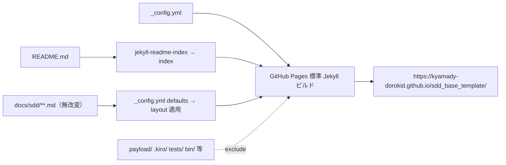

# Design Document: GitHub Pages でのドキュメント公開（github-pages-docs）

## Overview

**Purpose**: `README.md`（トップ）と `docs/sdd/**` を GitHub Pages（Jekyll 標準ビルド）で公開し、
ブラウザから章立てで閲覧できるドキュメントサイトにする。
**Users**: `sdd_base_template` の利用者・導入検討者・レビュアー。
**Impact**: リポジトリ root に `_config.yml` を1つ追加し Pages を有効化するのみ。`payload/`・`docs/sdd/**` の
md 本文・既存 CLI には一切影響しない。

### Goals
- README をトップ、`docs/sdd/**` を HTML で閲覧可能に（Req 1）。
- `docs/sdd/**` の md 本文を無改変（sync 安全・Req 2）。
- CI・重い依存を追加しない（GitHub Pages 標準 Jekyll ビルド）。

### Non-Goals
- MkDocs/Docusaurus・GitHub Actions ビルド・独自ドメイン・doc-export による HTML 生成。

## Boundary Commitments

### This Spec Owns
- リポジトリ root の `_config.yml`（サイト設定）。
- GitHub Pages の有効化操作（`gh api`）。
- README への公開サイトリンク追記。

### Out of Boundary
- `docs/sdd/**` の md 本文（front-matter 追加禁止・sync 安全）。
- `payload/overlay/**`（配布物）・既存 CLI・スキル。

## Architecture

### 方式
GitHub Pages の **"Deploy from a branch"（source: `main` / `/`(root)）＋ Jekyll 標準ビルド**を用いる。
GitHub Pages が既定で有効化する2プラグインを活用し、**コンテンツ md を無改変**でサイト化する:

- **`jekyll-readme-index`（GH Pages 既定有効）**: root の `README.md` を自動的にサイトの index にする
  → 別途 `index.md` を作らずに「README をトップ」を実現（決定3）。
- **`jekyll-relative-links`（GH Pages 既定有効）**: md 内の相対リンク（`[...](docs/sdd/workflow.md)` 等）を
  公開ページ間で `.html` へ解決 → 本文改変なしでリンク切れを防ぐ（Req 3.1）。
- **`_config.yml` の `defaults`**: front-matter の無い md に `layout` を自動適用
  → `docs/sdd/**` に front-matter を書かずに HTML レンダリングされる（Req 2.1）。



### sync 安全性の担保（Req 2）
- `_config.yml` は **root 直下**（`payload/` 外・`docs/sdd/` 外）。overlay 配布にも sync 管理対象にも含まれない
  → 配布物・sync に影響しない。
- `docs/sdd/**` の md は**一切編集しない**（レイアウトは `defaults`、リンクはプラグインで解決）
  → `sync` の managed_docs 判定で payload と一致し続け、コンフリクト・差分を生じない。

## File Structure Plan

### 追加ファイル
- `_config.yml`（新規・root）— サイト設定。

### 変更ファイル
- `README.md` — 先頭付近に公開サイトへのリンク（バッジ/URL）を1行追加（Req 4.3）。README は overlay 配布物では
  ないため編集可（sync 非対象）。

### `_config.yml`（設計内容）
```yaml
title: sdd_base_template
description: SDDベース（cc-sdd + 独自overlay）を任意リポジトリへ展開するインストーラ/スキル
theme: minima
plugins:
  - jekyll-relative-links     # 相対 .md リンクを .html へ解決（GH Pages 既定）
  - jekyll-readme-index       # README.md をサイト index にする（GH Pages 既定）
defaults:                      # front-matter の無い md にレイアウトを適用（本文を無改変でサイト化）
  - scope: { path: "" }
    values: { layout: "page" }
exclude:                       # 非ドキュメントをサイトから除外
  - payload/
  - .kiro/
  - tests/
  - bin/
  - scripts/
  - skills/
  - .agents/
  - .claude/
  - .codex/
  - node_modules/
  - package.json
  - AGENTS.md
  - CLAUDE.md
```
> `AGENTS.md`/`CLAUDE.md` はエージェント用メンテ規約のためサイトから除外（利用者向けは README＋docs/sdd）。
> `defaults` の `path: ""` は全ファイル対象。README は `jekyll-readme-index` が index 化するため実質トップになる。

## Error Handling / リスク

- **README が index にならない場合**: `jekyll-readme-index` は GH Pages 既定だが、万一トップが 404 等になる場合の
  フォールバックとして root に最小の `index.md`（front-matter＋短い誘導のみ）を追加する。**この場合も docs/sdd は無改変**。
  実装の検証ステップで判断する。
- **Pages ビルド失敗**: `gh api .../pages/builds/latest` の状態を確認し、`errored` ならログを見て `_config.yml` を修正
  （本 spec スコープ内）。
- **相対リンク**: `jekyll-relative-links` で解決。検証で代表リンク（README→docs/sdd/workflow 等）を実確認する。

## 有効化手順（Req 4.1）

`gh api` で Pages を有効化（source=main / path=`/`・Jekyll レガシービルド）:
```
gh api -X POST repos/kyamady-dorokid/sdd_base_template/pages \
  -f 'source[branch]=main' -f 'source[path]=/'
```
- 既に存在する場合は `PUT` で更新。`_config.yml` は本 PR を main へマージ後にビルドが走る。

## Testing / 検証（Req 4.2）

- **既存への非影響**: `bash tests/run.sh` が従来どおり全 PASS（bash ロジックを変えないため 145 件維持）。
- **sync 安全性**: `docs/sdd/**` 無改変 → `node bin/cli.js sync --yes` 後に docs/sdd の差分・コンフリクトが無いこと。
- **Pages 検証**（有効化後）:
  1. `gh api .../pages/builds/latest` の `status` が `built`。
  2. 公開 URL（`/`）が 200 で README 内容を表示。
  3. `docs/sdd/workflow` 等 代表ページが 200 表示。
  4. README→docs/sdd の相対リンクが辿れる（`.html` 解決）。

> 本タスクは設定中心のため `tests/` への自動テスト追加は行わない（検証は上記の実確認・記録は test-results.md）。
