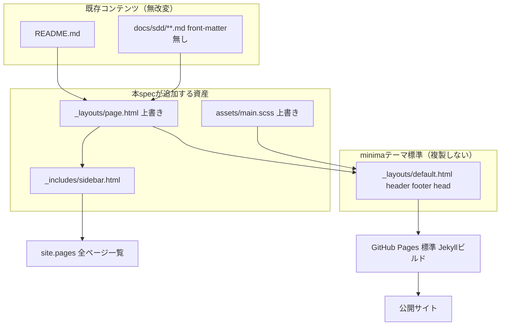

# Design Document: GitHub Pagesサイトのデザイン強化（pages-doc-site-design）

## Overview

**Purpose**: `github-pages-docs` spec で公開済みの GitHub Pages サイト（minima テーマの素の状態）に、
サイドバーナビゲーションと見出し・コードブロック・表の視認性向上を追加し、ドキュメントサイト風の
閲覧体験にする。
**Users**: 公開サイトの訪問者（本テンプレートの利用者・導入検討者・レビュアー）。
**Impact**: リポジトリ root に `_layouts/page.html`（minima の上書き）・`_includes/sidebar.html`・
`assets/main.scss`（minima の上書き）を追加するのみ。`docs/sdd/**` の md 本文・`_config.yml`・
`payload/**` には一切変更を加えない。

### Goals
- README（トップ）＋ `docs/sdd/**` の全ページで一貫したサイドバーナビゲーションを表示する（Req 1）。
- 見出し・コードブロック・表の視認性を向上させる（Req 2）。
- `docs/sdd/**` の md 本文・front-matter を無改変のまま実現する（Req 3）。
- GitHub Pages 標準の Jekyll ビルドのみで完結させ、CI/Actions を追加しない（Req 3.2）。

### Non-Goals
- `docs/sdd/**` の内容・掲載範囲の変更（`github-pages-docs` spec の範囲）。
- MkDocs/Docusaurus・別テーマへの全面差し替え、検索機能の追加。
- モバイル最適化以外のレスポンシブ対応の作り込み（基本的な可読性維持のみ）。

## Boundary Commitments

### This Spec Owns
- `_layouts/page.html`（minima テーマの同名レイアウトを上書き）。
- `_includes/sidebar.html`（新規、サイドバーナビの描画ロジック）。
- `assets/main.scss`（minima テーマの同名エントリポイントを上書き、見た目のカスタマイズ）。

### Out of Boundary
- `docs/sdd/**` の md 本文・front-matter（`github-pages-docs` spec の制約を継承し、無改変）。
- `_config.yml`・GitHub Pages の有効化設定（`github-pages-docs` spec が所有）。
- `payload/overlay/**`（配布物）。
- `_layouts/default.html`（テーマ標準のヘッダー/フッター/`<head>`はそのまま使用し、複製・上書きしない）。

### Allowed Dependencies
- GitHub Pages が既定で有効化するプラグイン（`jekyll-optional-front-matter` / `jekyll-default-layout` /
  `jekyll-titles-from-headings` / `jekyll-readme-index` / `jekyll-relative-links`）。追加の gem 依存は導入しない。
- minima テーマ（`github-pages-docs` spec で選定済み）の `default.html` レイアウト・既定 Sass 変数。

### Revalidation Triggers
- `docs/sdd/**` にルート（`docs/sdd/` 直下）・`rules/`・`templates/` 以外の新しいディレクトリ階層が
  追加された場合、`_includes/sidebar.html` のグループラベル対応表の見直しが必要
  （フォールバック表示はされるが、ラベルが機械的になる）。
- GitHub Pages の既定プラグイン一覧（`pages.github.com/versions/`）から `jekyll-titles-from-headings` が
  外れた場合、`page.title` 自動抽出が機能しなくなり、本設計のナビ・見出し表示に影響する。
- minima テーマのメジャーバージョンアップで `default.html` の構造（`content` の受け渡し方・
  `page-content` のクラス名等）が変わった場合、`_layouts/page.html` の整合性再確認が必要。

## Architecture

### Existing Architecture Analysis
`github-pages-docs` spec により、`_config.yml` の `defaults`（`layout: page`）と GitHub Pages 既定
プラグインの組み合わせで、`docs/sdd/**` の front-matter 無し md も Jekyll の Page として処理され、
minima の `page.html` → `default.html` を経由してレンダリングされている（`research.md` で実サイトの
出力クラスから確認済み）。本 spec はこの既存経路に乗り、`page.html` のみを差し替える。

### Architecture Pattern & Boundary Map



**Architecture Integration**:
- 選定パターン: 既存の Jekyll テーマ上書き機構（プロジェクト直下の同一相対パスファイルがテーマ gem を上書き）。
- ドメイン境界: コンテンツ（`docs/sdd/**`・README）／テーマ既定（`default.html`）／本spec資産
  （`page.html`・`sidebar.html`・`main.scss`）を明確に分離。
- 既存パターン維持: `_config.yml` の `defaults` によるレイアウト自動適用、`site.pages` によるページ列挙。
- 新規コンポーネントの理由: サイドバーは既存のどの資産にも存在しないため `_includes/sidebar.html` を新設。
  `page.html`/`main.scss` は「テーマ上書き」という既存の拡張ポイントを使うため新規ファイルとして追加。
- Steering準拠: 「重い依存を持ち込まない」（新規 gem 依存ゼロ）を維持。

### Technology Stack

| Layer | Choice / Version | Role in Feature | Notes |
|-------|------------------|-----------------|-------|
| サイトジェネレータ | Jekyll（GitHub Pages 標準ビルド、`github-pages-docs` spec で選定済み） | サイドバー・スタイルのレンダリング基盤 | バージョン固定は GitHub Pages 側管理、本specでは指定しない |
| テーマ | minima（既定バージョン、`github-pages-docs` spec で選定済み） | `default.html`・既存 Sass 変数の提供元 | `page.html`/`main.scss` のみ上書き |
| テンプレート言語 | Liquid（Jekyll組み込み） | `site.pages` 走査・グルーピングによるナビ生成 | 追加ライブラリ不要 |
| スタイル | Sass/SCSS（Jekyll組み込みの Sass 変換、minima 経由） | 見出し・コードブロック・表・サイドバーレイアウトの視認性向上 | `assets/main.scss` で `@import "minima"` 後に追加ルールを定義 |

## File Structure Plan

### 追加ファイル（テーマ上書き含む）
```
_layouts/
└── page.html          # minima標準page.htmlの上書き。layout: default を維持しヘッダー/フッターはテーマ標準を継続使用。
                        # サイドバー(sidebar.html)とメインコンテンツ領域(post/post-header/post-content)を配置。

_includes/
└── sidebar.html        # site.pagesをpage.dirでグルーピングしてサイドバーナビを描画。
                        # ディレクトリ→表示ラベル対応表（README=トップ, docs/sdd/, docs/sdd/rules/, docs/sdd/templates/）を保持し、
                        # 未知ディレクトリはディレクトリ名をそのままラベルにフォールバックする。
                        # 現在表示中ページは page.url == 対象ページ.url で判定しCSSクラスを付与する。

assets/
└── main.scss            # minima標準assets/main.scssの上書き。`@import "minima";` の後に
                        # サイドバー用グリッドCSSと見出し/コードブロック/表の視認性向上ルールを追加。
```

### 変更ファイル
なし（既存ファイルへの変更は発生しない。すべて新規ファイルによるテーマ上書き）。

> `docs/sdd/**`・README.md・`_config.yml`・`payload/**` はいずれも変更しない（Boundary Commitments参照）。

## Requirements Traceability

| Requirement | Summary | Components | Interfaces | Flows |
|-------------|---------|------------|------------|-------|
| 1.1 | 全ページにサイドバーナビ表示 | `_includes/sidebar.html`, `_layouts/page.html` | `site.pages` 走査 | Architecture図 |
| 1.2 | 現在ページの視覚的区別 | `_includes/sidebar.html` | `page.url` 比較 | - |
| 1.3 | リンククリックで404なく遷移 | `_includes/sidebar.html` | `page.url`（Jekyll生成の実URL） | - |
| 1.4 | 新規ページの自動反映 | `_includes/sidebar.html` | `site.pages`／`page.dir` グルーピング | - |
| 2.1 | 見出しレベルの視覚的区別 | `assets/main.scss` | Sassルール（h1〜h3） | - |
| 2.2 | コードブロックの視覚的区別 | `assets/main.scss` | Sassルール（`pre`/`code`） | - |
| 2.3 | 表の視認性向上 | `assets/main.scss` | Sassルール（`table`/`th`/`td`） | - |
| 3.1 | `docs/sdd/**` md本文無改変 | Boundary Commitments（Out of Boundary） | - | - |
| 3.2 | CI/Actions非追加 | Technology Stack（追加gem依存ゼロ） | - | - |
| 3.3 | `payload/overlay/**` 無変更 | Boundary Commitments（Out of Boundary） | - | - |
| 3.4 | front-matter無しでも適用 | `_includes/sidebar.html`, `_layouts/page.html` | `site.pages`／`_config.yml`既定layout（既存） | Architecture図 |
| 4.1 | ビルド成功 | Testing Strategy | `gh api .../pages/builds/latest` | - |
| 4.2 | 既存代表ページ200維持 | Testing Strategy | `curl` 検証 | - |
| 4.3 | sync後の差分・コンフリクトなし | Testing Strategy | `node bin/cli.js sync --yes` | - |

## Components and Interfaces

| Component | Domain/Layer | Intent | Req Coverage | Key Dependencies (P0/P1) | Contracts |
|-----------|--------------|--------|--------------|--------------------------|-----------|
| `_layouts/page.html` | プレゼンテーション（レイアウト） | サイドバーとメインコンテンツの2カラム構造を提供 | 1.1, 3.4 | `_layouts/default.html`（テーマ標準, P0）, `_includes/sidebar.html`（P0） | State |
| `_includes/sidebar.html` | プレゼンテーション（ナビ生成） | `site.pages` からナビ構造を組み立てて描画 | 1.1, 1.2, 1.3, 1.4, 3.4 | `site.pages`（Jekyll組み込み, P0） | State |
| `assets/main.scss` | プレゼンテーション（スタイル） | 見出し・コードブロック・表・サイドバーの視認性向上 | 2.1, 2.2, 2.3 | minima既定Sass変数（P1） | - |

### プレゼンテーション層

#### `_layouts/page.html`

| Field | Detail |
|-------|--------|
| Intent | サイドバー付きの2カラムページ構造を提供する（README・`docs/sdd/**` 共通） |
| Requirements | 1.1, 3.4 |

**Responsibilities & Constraints**
- front-matter で `layout: default` を維持し、minima標準の `default.html`（ヘッダー・フッター・`<head>`）
  をそのまま利用する。`default.html` 自体は複製・変更しない。
- 既存のクラス（`post`, `post-header`, `post-title`, `post-content`）を維持し、`assets/main.scss` 側の
  スタイル拡張が minima 標準クラスに乗せられるようにする。
- サイドバー（``）とメインコンテンツを1つのコンテナ要素で包み、CSSグリッド/フレックス
  でレイアウトできる構造にする。

**Contracts**: State [x]

##### State Management
- 状態モデル: なし（ビルド時に静的HTMLへ変換されるのみ。実行時状態は持たない）。
- 永続化: 生成される静的HTMLファイルとして GitHub Pages に配信される。

#### `_includes/sidebar.html`

| Field | Detail |
|-------|--------|
| Intent | `site.pages` を走査し、ディレクトリ単位でグルーピングしたサイドバーナビを描画する |
| Requirements | 1.1, 1.2, 1.3, 1.4, 3.4 |

**Responsibilities & Constraints**
- `site.pages` から対象ページ（README＋`docs/sdd/**`）を抽出する。`_config.yml` の `exclude` に
  無いディレクトリ（例: `docs/specs/**`＝旧形式spec記録、`assets/main.scss` 自身のビルド出力）も
  `site.pages` には含まれるため、`page.url == '/'` または `page.dir` が `/docs/sdd` を含む、という
  明示的な条件でナビ対象を絞り込む（実装検証で判明した差分を反映。2026-07-14 修正、
  `agreement-log.md` 参照）。
- `page.dir` でグルーピングし、ディレクトリ→表示ラベルの対応表（`/`＝トップ、`/docs/sdd/`、
  `/docs/sdd/rules/`、`/docs/sdd/templates/`）でセクション見出しを付ける。対応表に無いディレクトリは
  ディレクトリ名をそのままラベルとして表示する（フォールバック、Req 1.4 を将来のディレクトリ追加にも対応させる）。
  下位互換のためグループの並び順は固定の優先順位リストで制御する。
  グループ内の各ページは `page.title`（`jekyll-titles-from-headings` によりH1から自動取得済み）を表示テキストにする。
  現在表示中のページは `page.url == 対象ページ.url` の一致判定で `is-active` 相当のクラスを付与し、
  `assets/main.scss` 側で視覚的に区別する。

**Contracts**: State [x]

##### State Management
- 状態モデル: なし（`site.pages` はビルド時にJekyllが構築する読み取り専用のグローバルデータ）。

**Implementation Notes**
- Integration: `_layouts/page.html` から `` で呼び出される。
- Validation: 実装後、GitHub Pages 実ビルドでナビ内の全リンクが200を返すことを確認する（Testing Strategy参照）。
- Risks: グルーピング対象ディレクトリの想定漏れ（Revalidation Triggers参照）。

#### `assets/main.scss`

| Field | Detail |
|-------|--------|
| Intent | minima既定スタイルを維持しつつ、サイドバーレイアウトと見出し/コードブロック/表の視認性を拡張する |
| Requirements | 2.1, 2.2, 2.3 |

**Responsibilities & Constraints**
- 冒頭で `@import "minima";` を維持し、minima の変数・基本スタイルを継承する。
- 見出し（h1〜h3相当）をフォントサイズ・太さ・余白で段階的に区別する。
- コードブロック（フェンスドコード・インラインコード）を背景色・等幅フォントで本文と区別する。
- 表（`table`/`th`/`td`）に罫線・行間・ヘッダー強調を適用する。
- サイドバーとメインコンテンツの2カラムグリッド（狭幅画面では1カラムに縮退する簡易対応を含む）。

**Implementation Notes**
- Integration: `_layouts/page.html` が出力するクラス（`post-content` 等）とサイドバーのクラスに対して
  スタイルを適用する。
- Validation: 実サイトで見出し・コードブロック・表を含む代表ページ（例: `docs/sdd/rules/testing-policy.md`）
  の表示を目視確認する。
- Risks: minima既定スタイルとの詳細度（CSS specificity）競合。`@import "minima";` の後に追記することで
  上書き優先度を確保する。

## Testing Strategy

> 設定・スタイル中心のため自動テストは追加しない。ローカルに Jekyll ツールチェーンが無い環境のため、
> 検証は実際の GitHub Pages ビルド・実URLアクセスで行う（`github-pages-docs` spec と同じ方式）。

- **ビルド検証**: 実装後、`gh api .../pages/builds/latest` の `status` が `built` になることを確認する（4.1）。
- **代表ページ表示検証**: README（トップ）・`docs/sdd/workflow`・`docs/sdd/rules/testing-policy`・
  `docs/sdd/templates/agreement-log` の4ページが 200 応答し、各ページにサイドバーナビが表示されることを
  `curl`／目視で確認する（1.1, 4.2）。
- **ナビゲーション検証**: サイドバー内の代表的なリンク（README→docs/sdd/workflow、
  docs/sdd/workflow→docs/sdd/rules配下）をクリックし、404にならないことを確認する（1.3）。
- **現在地表示検証**: `docs/sdd/workflow` を開いた際、サイドバー内の該当リンクが視覚的に区別されていることを
  目視確認する（1.2）。
- **自動反映検証**: 実装後の動作確認として、一時的なダミーmd（例 `docs/sdd/_tmp-nav-check.md`）を追加して
  サイドバーに自動反映されることを確認し、確認後は削除する（1.4）。
- **視認性検証**: 見出し3段階・コードブロック・表を含む代表ページで、視覚的な区別がついていることを
  目視確認する（2.1, 2.2, 2.3）。
- **sync安全性検証**: `node bin/cli.js sync --yes` 実行後、`docs/sdd/**` に差分・コンフリクトが生じないことを
  `git diff`／sync レポートで確認する（4.3、`github-pages-docs` spec と同じ観点）。
- **既存回帰**: `bash tests/run.sh` が引き続き全PASSであることを確認する（bashロジック非変更のため回帰のみ）。

<!-- SDD-OVERLAY:DESIGN-TECHREQ:START (sdd_base_template が付加。手動編集は再 init で再付与される) -->
## 技術要件・制約チェック（SDD overlay / 初回実装時）

> 旧 `tech-requirements.md` はこの節に統合済み。独立ファイルは作らない。
> 言語/FW/ライブラリは **Technology Stack**、テスト方針は **Testing Strategy**、既存コード結合は
> **Existing Architecture Analysis / Modified Files** に記載する。本節はそれらに収まらない
> 「環境固有の制約」と「初回実装前の確認」だけを補う。

### 環境固有の制約
| 制約 | 内容 |
|---|---|
| 言語ランタイムのバージョン制約 | なし（GitHub Pages 標準ビルドが Jekyll/Ruby バージョンを管理。本spec側でのピン留めなし） |
| データストアのバージョン制約 | 該当なし（静的サイト、データストアなし） |
| Docker / 実行環境での考慮事項 | ローカルに Jekyll ツールチェーン（gem）が無いため、ローカルビルドプレビューはできない。検証は実際の GitHub Pages ビルドで行う |
| その他 | `_layouts/default.html` は複製・変更しない（Boundary Commitments参照）。minima のメジャーバージョンアップ時は再検証が必要（Revalidation Triggers参照） |

### 初回実装前の確認
- [ ] 上記スタック・テスト方針・既存結合・環境制約を確認した
- [ ] 人間が技術要件を確認した（**承認の記録は `spec.json` の design ゲートに集約。本チェックは二重管理しない**）
<!-- SDD-OVERLAY:DESIGN-TECHREQ:END -->
