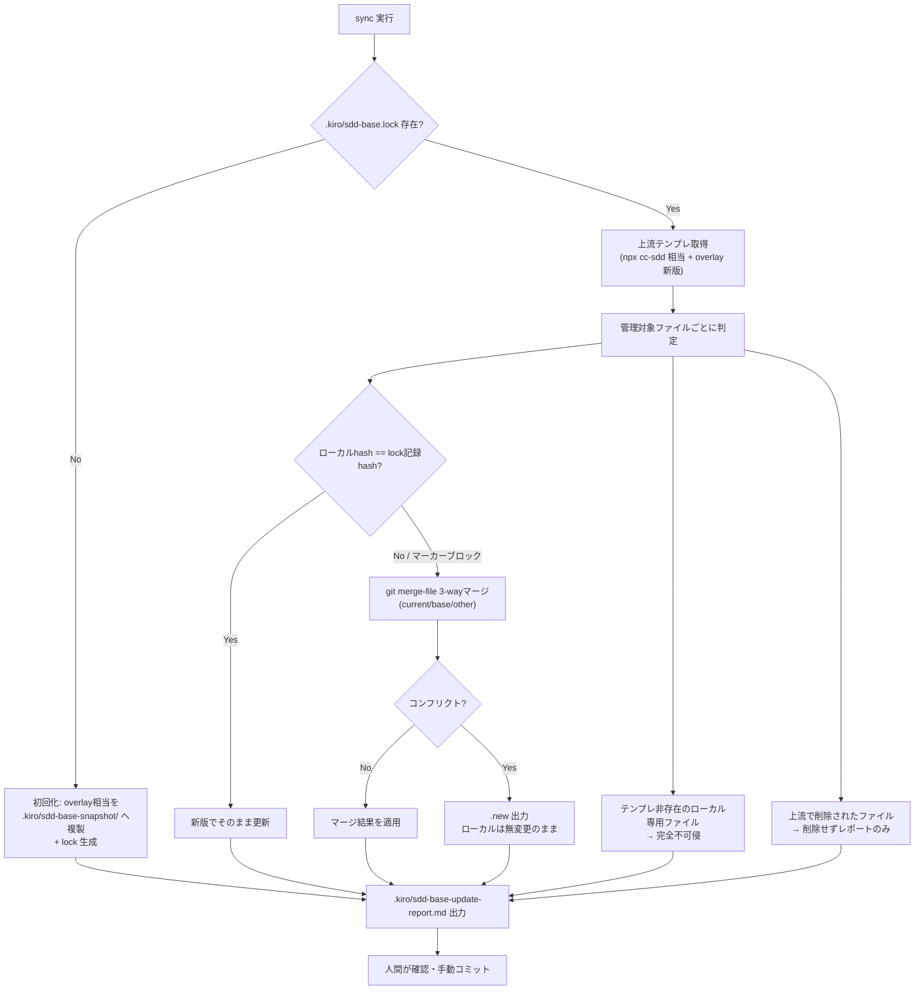

# Design Document: sdd_base_template 安全な更新機構（sync コマンド, Part B）

## Overview

`sync` は、既に `init` 済みのリポジトリへ上流テンプレート（`sdd_base_template`）の更新内容を
安全に反映する新規CLIサブコマンドである。初回実行時に適用状態のスナップショットと lock ファイルを
作成し、以降の実行では lock を基準にローカル変更の有無を判定して、未変更ファイルは更新・変更済み
ファイルは3-wayマージ・コンフリクトは非破壊的にレポートする。

**Users**: `sdd_base_template` を導入済みのリポジトリの開発者・SDD運用者。
**Impact**: 既存の `init`/`validate`/`install`/`update` の挙動は変更しない。新規ファイル
（`payload/scripts/sync.sh` 等）の追加のみ。対象リポジトリ側には `.kiro/sdd-base.lock` と
`.kiro/sdd-base-snapshot/` が新規にコミットされる。

### Goals
- 上流更新を「サイレント上書きゼロ」で反映できること。
- ローカルカスタマイズ（overlay ファイルへの追記、マーカーブロック内外の混在編集）を保持したまま
  テンプレ更新分だけを取り込めること。
- 既存の bash 完結スタイル・冪等パッチ機構と一貫した実装であること。

### Non-Goals
- `init` コマンド自体の上書き挙動（`--on-existing`）を変更すること。
- コンフリクトの自動解決（人間の確認を必ず要求する）。
- `cyclox2_docker` 側の `docs/specs/` → `.kiro/specs/` 追随移行。

## Boundary Commitments

### This Spec Owns
- 新規 `sync` コマンド（`bin/cli.js sync` → `payload/scripts/sync.sh`）。
- lock ファイル（`.kiro/sdd-base.lock`）とスナップショット（`.kiro/sdd-base-snapshot/`）の
  フォーマット・生成・更新ロジック。
- 3-wayマージ判定ロジックとマーカーブロック単位マージ、差分レポート（`.kiro/sdd-base-update-report.md`）。

### Out of Boundary
- `init.sh`/`validate.sh`/`update`（テンプレ開発者向け）の既存ロジック変更。
- `.kiro/specs/`, `.kiro/steering/`, `docs/architecture/` 等のプロジェクト固有ファイルへの一切の関与。

### Allowed Dependencies
- `payload/scripts/init.sh` が定義する overlay 適用対象ファイル一覧・マーカー規約
  （`SDD-BASE:START`/`SDD-OVERLAY:*`）を再利用する。
- 標準 `git`（`git merge-file` を3-wayマージエンジンとして利用）、`sha256sum`/`shasum`、`bash` 3.2 互換。

### Revalidation Triggers
- `payload/overlay/` 配下の管理対象ファイル構成が変わった場合（sync の対象ファイル列挙を更新）。
- 新しい `SDD-OVERLAY:*` マーカーパッチが追加された場合（lock フォーマットの `block:` 行対象に追加）。
- `init.sh` の overlay 適用ステップ（[5/6]）の出力ファイル構成が変わった場合。

## Architecture

### Existing Architecture Analysis
- `init.sh` は6ステップ（cc-sdd取得→pre検証→パッチ適用→overlay適用→post検証）の一方向処理で、
  「まっさらな適用」しか想定していない。`--overwrite=force`+`--backup` はファイル単位の退避のみで、
  3-wayマージや「ローカル変更の検知」は行わない。
- 既存パッチ（`payload/validation/patches/*.sh`）は「引数=repo_root、マーカー検出で冪等スキップ、
  末尾追記のみ」という一方向の加算パターン。sync はこのマーカー規約をそのまま「ブロック抽出→
  3-wayマージ→書き戻し」に転用する。

### Architecture Pattern & Boundary Map



**Architecture Integration**:
- 選択パターン: lock + ローカル永続スナップショットによる「3-wayマージ台帳」方式
  （ネットワーク経由の過去コミットre-clone方式は不採用。理由: ネットワーク依存・履歴改変リスク回避）。
- 責務境界: `sync.sh` は overlay 管理対象ファイルのみを扱う。`.kiro/specs/`・`.kiro/steering/` 等
  プロジェクト固有領域には一切触れない（`init.sh` の `PROTECTED` 判定と同じ考え方を踏襲）。
- 既存パターン維持: bash 完結・冪等マーカー・`say`/`ok`/`ng` 形式のログ出力（`validate.sh` に倣う）。
- 新規コンポーネントの理由: lock/snapshot/3-wayマージは `init.sh`/`validate.sh` の責務（一方向適用・
  検証）と性質が異なるため、独立スクリプト `sync.sh` として分離する。

### Technology Stack

| Layer | Choice / Version | Role in Feature | Notes |
|-------|------------------|-----------------|-------|
| CLI | Node.js（既存 `bin/cli.js`） | `sync` サブコマンドの追加エントリポイント | 既存 `init`/`validate` と同じ `sh()` ヘルパーで bash 起動 |
| 実装本体 | bash 3.2 互換 | `payload/scripts/sync.sh` | `init.sh`/`validate.sh` と同一の互換性制約（`set -u` + 空配列イディオム） |
| マージエンジン | `git merge-file` | 3-wayマージ | 追加依存なし（git は前提環境） |
| ハッシュ | `sha256sum`（Linux）/ `shasum -a 256`（macOS） | lock のファイル/ブロック整合性判定 | 環境差異吸収のラッパー関数を用意 |
| 永続化 | フラットテキスト（lock）+ ファイルツリー（snapshot） | 状態保存 | JSON非依存。対象リポジトリにコミットされる |

## File Structure Plan

### Directory Structure
```
payload/
├── scripts/
│   ├── sync.sh                    # 新規: sync 本体（lock/snapshot/3-wayマージ/レポート）
│   ├── sync_lib/
│   │   ├── hash.sh                # sha256 ラッパー（Linux/macOS吸収）
│   │   ├── lock.sh                # lock ファイルの読み書き・パース
│   │   └── merge.sh               # ファイル全体3-way / マーカーブロック単位3-way
│   └── init.sh, validate.sh, update.sh  # 既存・変更なし
└── validation/
    └── checks.md                  # 変更: lock整合性・ローカル変更保持のチェック項目を追加

<対象リポジトリ側（sync実行後に生成・コミットされる）>
.kiro/
├── sdd-base.lock                  # 新規: lock ファイル（行指向）
├── sdd-base-snapshot/             # 新規: 適用時点の overlay 相当の複製（3-wayマージのbase）
└── sdd-base-update-report.md      # 新規: 実行結果レポート（sync実行のたびに上書き）
```

### Modified Files
- `bin/cli.js` — `sync` サブコマンド追加（`init`/`validate` と同じ `sh()` 経由で `sync.sh` を呼ぶ）。
- `payload/validation/checks.md` — lock整合性・ローカル変更保持のチェック項目を追加（新セクション）。
- `README.md` — 「その他の使い方」節に `sync` の説明を追加。

## System Flows

初回実行と2回目以降で分岐が異なるため、上記 Architecture Pattern の mermaid（flowchart）を
本節のシステムフローとして兼用する。追加のシーケンス図は不要（CLIの単純な逐次処理のため）。

補足（ゲーティング条件）:
- lock 不在 → 初回化ルート（判定ロジックなしで即スナップショット作成）。
- lock 有り、対象ファイルがマーカー未含有の通常ファイル → ファイル全体3-wayマージ。
- lock 有り、対象ファイルが `SDD-BASE:*`/`SDD-OVERLAY:*` マーカーを含む → ブロック抽出→3-wayマージ→
  マーカー間へ差し戻し（周囲のプロジェクト固有内容は非対象）。

## Requirements Traceability

| Requirement | Summary | Components | Interfaces | Flows |
|-------------|---------|------------|------------|-------|
| 1.1–1.4 | 初回 lock・スナップショット作成 | `sync.sh`(init分岐), `lock.sh` | lockファイル書式 | 初回化ルート |
| 2.1–2.9 | 3-wayマージ本体 | `sync.sh`(判定), `merge.sh`, `hash.sh` | `git merge-file` 呼出 | 判定〜マージ〜出力ルート |
| 3.1–3.4 | 可視化・非破壊性 | `sync.sh`(レポート生成) | `.kiro/sdd-base-update-report.md` | 全ルート合流点 |
| 4.1–4.4 | 既存コマンド非衝突・検証統合 | `bin/cli.js`, `checks.md` | `sync` サブコマンド | - |

## Components and Interfaces

| Component | Domain/Layer | Intent | Req Coverage | Key Dependencies (P0/P1) | Contracts |
|-----------|--------------|--------|--------------|---------------------------|-----------|
| `bin/cli.js` の `sync` ハンドラ | CLI | サブコマンドルーティング | 4.1 | `payload/scripts/sync.sh` (P0) | Batch |
| `sync.sh` | Script | 全体オーケストレーション | 1, 2, 3 | `lock.sh`/`merge.sh`/`hash.sh` (P0) | Batch |
| `sync_lib/lock.sh` | Script | lock読み書き・ハッシュ比較 | 1.2, 1.3, 2.1 | `hash.sh` (P0) | Batch |
| `sync_lib/merge.sh` | Script | ファイル全体/ブロック単位3-wayマージ | 2.3–2.7 | `git merge-file` (P0) | Batch |
| `sync_lib/hash.sh` | Script | sha256計算（環境吸収） | 1.2 | `sha256sum`/`shasum` (P1) | Batch |

### Script / Batch Layer

#### `sync.sh`

| Field | Detail |
|-------|--------|
| Intent | `sync` 実行の一連の流れ（初回化 or 差分適用 → レポート出力）を統括する |
| Requirements | 1.1, 1.4, 2.1, 2.8, 2.9, 3.1, 3.2, 3.3, 3.4 |

**Responsibilities & Constraints**
- 引数: `sync.sh <repo_root> <payload_dir> [--yes]`（既存 `init.sh` と同じ引数規約）。
- lock不在時は初回化ルートのみ実行し、判定ロジックには入らない。
- 破壊的操作（既存ローカルファイルの上書き）を行う分岐では、必ず事前にレポート内容を確定してから
  書き込みを行う（「サイレント上書き厳禁」を構造的に担保するため、書き込みは判定完了後の最終ステップに集約）。

**Contracts**: Batch [x]

##### Batch / Job Contract
- Trigger: `bin/cli.js sync` からの手動実行。
- Input / validation: `.kiro/sdd-base.lock`（存在すれば読み込み）、`payload/overlay/` の現行内容、
  対象リポジトリの現行ファイル。
- Output / destination: 更新されたファイル群、`.kiro/sdd-base-update-report.md`、
  コンフリクト時の `<file>.new`。
- Idempotency & recovery: 同一状態で再実行しても既に反映済みの差分は再適用されない（lock を
  都度更新するため）。失敗時（マージ中断等）はローカルファイルを変更しないため、再実行で復帰可能。

#### `sync_lib/lock.sh`

| Field | Detail |
|-------|--------|
| Intent | lock ファイルのパース・生成・比較 |
| Requirements | 1.2, 1.3, 2.1 |

**Responsibilities & Constraints**
- lock 書式（行指向・`#` コメント許容）:
  ```
  template_commit=<sha>
  template_repo=<url>
  file:docs/sdd/workflow.md:<sha256>
  block:CLAUDE.md:SDD-BASE:<sha256-of-block-content>
  ```
- `template_commit` は `git -C "$PAYLOAD" rev-parse HEAD` を試行し、失敗時は
  固定リポジトリURL定数（`kyamady-dorokid/sdd_base_template`）へフォールカバックし、
  その旨をレポートに記載する。

## Data Models

### Logical Data Model（lock ファイル）

| フィールド | 型 | 説明 |
|---|---|---|
| `template_commit` | string（sha） | sync実行時点で参照した上流テンプレートのコミットSHA（取得不可時はフォールバック定数） |
| `template_repo` | string（url） | 上流テンプレートの git remote URL |
| `file:<path>:<sha256>` | 行 | 単独管理ファイルの適用時点ハッシュ |
| `block:<file>:<marker>:<sha256>` | 行 | マーカーブロック（`SDD-BASE`/`SDD-OVERLAY:*` 等）の適用時点ハッシュ |

**Consistency & Integrity**:
- lock はテキストの追記・全置換で管理し、部分書き換えは行わない（sync実行のたびに全体を再生成）。
- スナップショット（`.kiro/sdd-base-snapshot/`）は lock の `template_commit` と対になる「その時点の
  overlay 相当ツリー」であり、次回 sync 時の3-wayマージ `base` として使用後、新版で置き換える。

## Error Handling

### Error Strategy
- コンフリクト（3-wayマージ失敗）は **エラーではなく想定内の分岐** として扱い、プロセスは
  正常終了（exit 0）した上でレポートに明記する。人間の判断を要する状態を異常終了と混同しない。
- git や sha256 コマンドが利用不可などの**真の実行時エラー**は非ゼロ終了し、原因をログに出す。

### Error Categories and Responses
- **想定内分岐（コンフリクト）**: `<file>.new` 出力＋レポート記載。exit 0。
- **環境エラー（git/sha256 不在等）**: 即座に停止し、原因と対処（インストール手順）を提示。exit 1。
- **lock フォーマット破損**: 復旧不能と判断し、初回化ルートへのフォールバックを提案（自動フォールバックはしない。人間確認）。

### Monitoring
- `.kiro/sdd-base-update-report.md` が実行結果の唯一のログ（CIログ等の外部監視は対象外、ローカルCLIのため）。

## Testing Strategy

- **Unit Tests**:
  1. `hash.sh` が Linux(`sha256sum`)/macOS(`shasum -a 256`) 双方で同一ファイルから同一ハッシュを算出する。
  2. `lock.sh` の lock 生成・パースが往復一致する（生成→パース→再生成で差分なし）。
  3. `merge.sh` のファイル全体3-wayマージがクリーンケースで正しくマージされる。
  4. `merge.sh` のマーカーブロック抽出が、ブロック外の周囲コンテンツを変更しない。
- **Integration Tests**:
  1. 初回 `sync`（lock不在）→ lock・snapshot 生成、既存ファイル無変更。
  2. ローカル未変更ファイルへの2回目 `sync` → 新版でそのまま更新される。
  3. ローカル変更ファイル（非コンフリクト）への `sync` → クリーンマージが適用されレポートに記載。
  4. ローカル変更ファイル（コンフリクト）への `sync` → `<file>.new` 生成、既存ファイルは無変更。
  5. `.kiro/specs/`/`.kiro/steering/` 配下は `sync` 実行後も一切変更されない。
- **E2E/CLI Tests**:
  1. `node bin/cli.js sync` を空→初回→再実行の順で通し実行し、`pre/post` 相当の検証が通る。

<!-- SDD-OVERLAY:DESIGN-TECHREQ:START (sdd_base_template が付加。手動編集は再 init で再付与される) -->
## 技術要件・制約チェック（SDD overlay / 初回実装時）

> 旧 `tech-requirements.md` はこの節に統合済み。独立ファイルは作らない。
> 言語/FW/ライブラリは **Technology Stack**、テスト方針は **Testing Strategy**、既存コード結合は
> **Existing Architecture Analysis / Modified Files** に記載する。本節はそれらに収まらない
> 「環境固有の制約」と「初回実装前の確認」だけを補う。

### 環境固有の制約
| 制約 | 内容 |
|---|---|
| 言語ランタイムのバージョン制約 | bash 3.2.57（macOS標準）互換必須。`set -u` + 空配列は `${arr[@]+"${arr[@]}"}` イディオムを使用（`init.sh` 既存パターンを踏襲） |
| データストアのバージョン制約 | なし（ファイルシステムのみ） |
| Docker / 実行環境での考慮事項 | `git merge-file` はローカル一時ファイルを生成するため、書き込み可能な作業ディレクトリが必要 |
| その他 | `sha256sum` が無い環境（macOS標準）は `shasum -a 256` へフォールバックするラッパーが必須 |

### 初回実装前の確認
- [ ] 上記スタック・テスト方針・既存結合・環境制約を確認した
- [ ] 人間が技術要件を確認した（**承認の記録は `spec.json` の design ゲートに集約。本チェックは二重管理しない**）
<!-- SDD-OVERLAY:DESIGN-TECHREQ:END -->
