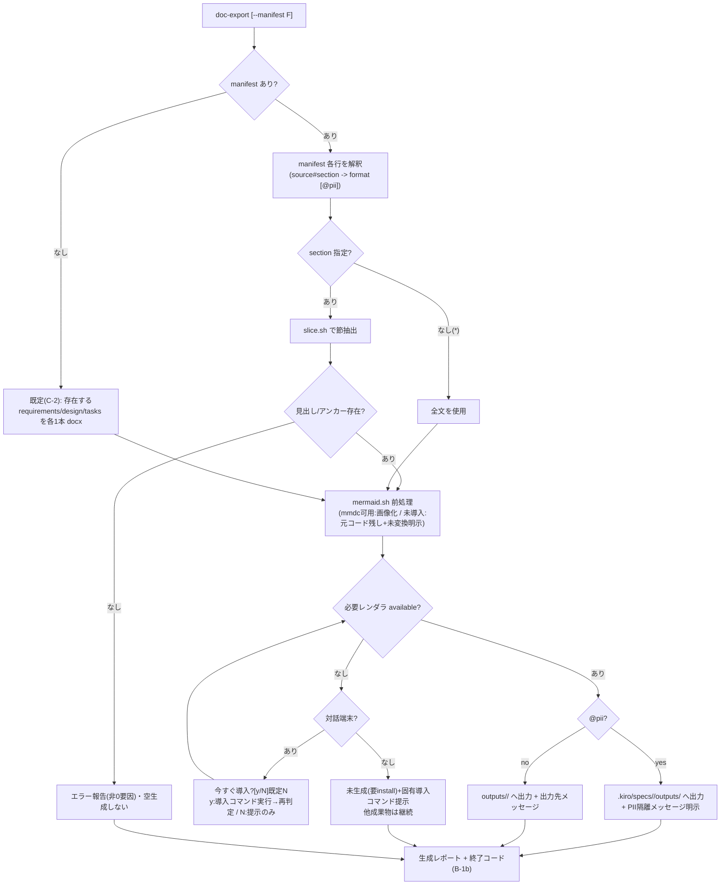

# Design Document: two-tier-deliverables（SDD成果物の二層化）

## Overview

**Purpose**: 一次成果物（md 正本）から、人間の検証・共有用の二次成果物（PDF/Word/PPT ほか）を
**一方向・opt-in・非破壊**で再生成する仕組みを SDD テンプレートに追加する。正本は物理分割せず、
監査対象別の人間向け文書は「節スライス生成」で満たす。
**Users**: SDD テンプレート利用者（人間レビュアー・非開発者への共有者）と、テンプレートのメンテナ。
**Impact**: 既存の `init`/`sync`/`validate`/overlay 機構に**加算的**な拡張を行う。cc-sdd は実行のみ・
非同梱の方針を維持し、重いレンダラ本体は同梱せず opt-in 取得とする。

### Goals
- 正本(md)→二次の一方向生成。承認・差分レビューは常に一次側（Requirement 1）。
- 二次成果物の出力先を用途で分離（ビルド=直下 `outputs/`、PII=spec 直下）し、出力時に明示（Requirement 2）。
- 全文変換／節スライスの両対応（Requirement 4）と、レンダラ未導入の明示的スキップ（Requirement 5）。
- doc-export スキルの Claude/Codex 同一配布（Requirement 6）と、sync/validate への統合（Requirement 9）。

### Non-Goals
- 正本 `design.md` の物理分割（不採用）。
- 二次→一次の逆変換。
- LaTeX/Java 等の重いレンダラ本体の同梱・再配布。
- 承認ブール値を agreement-log でも管理すること（spec.json に一元化・Requirement 10）。

## Boundary Commitments

### This Spec Owns
- 二層化の運用ルール文書（`payload/overlay/docs/sdd/` への追記、snippets のパリティ）。
- 二次成果物生成エンジン（`payload/scripts/doc-export/`）とレンダラ・レジストリ、マニフェスト解釈。
- doc-export スキル（`payload/overlay/skills/doc-export/`）の**新規配布機構**（init 設置・sync 管理）。
- `outputs/` の gitignore・出力先分岐・明示メッセージ。
- `bin/cli.js` の `doc-export` および `install-renderers` サブコマンド追加。
- `validate.sh`(post) の二層化検証項目。

> **doc-export 壁打ち（2026-07-03）で確定した設計（リカバリー・再承認対象）**:
> 実装中に承認済み設計に無い `doc-export` CLI を先行追加した逸脱を、正規の壁打ち→再承認で設計に反映する。
> - **A1**: `doc-export` を CLI サブコマンドとして正式化（スキルはこのコマンドの実行を案内。本体は非複製）。
> - **B-1b**: 終了コードは3分類（成功／未生成=想定内=0／エラー=非0）。**B-2a**: レポートは `outputs/<id>/`（gitignore）＋stdout。**B-3a**: spec-id 不在は exit 1。
> - **C-2**: マニフェスト不在時の既定は、存在する `requirements.md`/`design.md`/`tasks.md` を各1本・docx 全文（プロセス記録は既定対象外）。
> - **D-1a**: Mermaid 前処理を実装（mmdc で画像化→埋込）。mmdc 未導入時は元コードを残し「未変換」を明示（graceful）。
> - **導入導線**: 欠けたレンダラ固有の導入コマンドを提示。**対話端末では「今すぐ導入？[y/N] 既定N」を確認し、human 同意時のみ実行**（非対話は提示のみ・自動実行しない）。レンダラ→導入コマンドは `renderers.sh` に一元化（DRY）。

### Out of Boundary
- cc-sdd 生成物の内部ロジック改変（最小パッチのみ・Requirement 8.3）。
- `design.md` 物理分割・`tech-requirements.md` 復活（既存 NG 判定を維持・Requirement 8.1/8.2）。
- 既存完了 spec への spec.json 遡及（別チョア）。

### Allowed Dependencies
- 既存の overlay 適用機構（`init.sh` [5/6]）・sync の 3-way マージ（`sync_lib/*`）・マーカー規約。
- 外部レンダラ（`pandoc`・`mermaid-cli(mmdc)`・PDF エンジン等）は **PATH 上に存在すれば利用**、
  無ければスキップ。本体は同梱しない。
- bash 3.2 互換（既存スクリプトと同一制約）。

### Revalidation Triggers
- overlay 配布対象の集合が変わった場合（sync の `managed_*` を更新）。
- 新レンダラ追加時（レジストリと install-renderers を更新）。
- cc-sdd がスキルディレクトリ構成を変えた場合（doc-export 配置の非衝突を再確認）。

## Architecture

### Existing Architecture Analysis
- `init.sh` [5/6] は overlay として **(a) `docs/sdd/` 全体コピー**、**(b) CLAUDE/AGENTS へのマーカー注入**、
  **(c) `.gitignore` 追記**を行う。**新規スキルディレクトリを配布する経路は存在しない**
  （cc-sdd 生成スキルへの「追記パッチ」しか前例がない）。→ doc-export は新経路が必要。
- `sync.sh` は `managed_docs()`（`docs/sdd/**` を whole-file 3-way マージ）と `MANAGED_BLOCKS`
  （マーカーブロック単位マージ）の2系統。doc-export スキルは**ファイルツリー単位**なので
  `managed_docs` と同型の新系統 `managed_skills()` が自然。
- `.gitignore` 追記は行単位・欠落分のみ（sync の `apply_gitignore`）。`outputs/` 追加は加算的で安全。

### Architecture Pattern & Boundary Map

```mermaid
flowchart TD
    subgraph 配布層[配布・同期]
      P["payload/overlay/skills/doc-export/<br>payload/scripts/doc-export/"]
      P -->|init [5/6] 新ステップ| SKA[".claude/skills/doc-export/"]
      P -->|init [5/6] 新ステップ| SKB[".agents/skills/doc-export/"]
      P -->|sync managed_skills| SKA
      P -->|sync managed_skills| SKB
    end
    subgraph 生成層[二次成果物生成]
      M[".kiro/specs/<id>/deliverables.manifest<br>(無ければ既定)"] --> E["export.sh"]
      SRC[".kiro/specs/<id>/*.md（正本）"] --> E
      REG["renderers registry<br>(pandoc/mmdc/pdf…検出)"] --> E
      E -->|ビルド成果物| OUT["outputs/<id>/"]
      E -->|PII 含有| PII[".kiro/specs/<id>/outputs/"]
      E -->|未導入レンダラ| RPT["レポート: 未生成(要install)"]
    end
    CLI["bin/cli.js install-renderers"] -.opt-in 取得手順.-> REG
```

**Architecture Integration**:
- 選択パターン: **overlay 加算＋レジストリ駆動レンダラ＋マニフェスト宣言**。既存の
  「cc-sdd 非同梱／sync 非破壊／パリティ維持」の思想に一致。
- doc-export スキルは `.claude`/`.agents` に**バイト同一**で設置（cc-sdd の `agents/openai.yaml`
  のような片側専用物を持たないため、`diff -qr` で差分ゼロ＝`known-parity-diffs.txt` 登録不要）。
- 生成エンジンは bash 完結。レンダラは PATH 検出のみで本体非同梱。

### Technology Stack

| Layer | Choice / Version | Role | Notes |
|-------|------------------|------|-------|
| CLI | Node.js（既存 `bin/cli.js`） | `install-renderers` 追加 | 既存 `sh()` で bash 起動 |
| 生成エンジン | bash 3.2 互換 | `payload/scripts/doc-export/export.sh` ほか | 既存スクリプトと同一制約 |
| レンダラ（コア） | `pandoc` | md→docx/pdf/pptx | PATH 検出。無ければスキップ |
| レンダラ（図） | `mermaid-cli (mmdc)` | Mermaid→SVG/PNG | opt-in 推奨 |
| レンダラ（PDF） | pandoc の PDF エンジン or wkhtmltopdf 等 | pdf 出力 | 環境依存・opt-in |
| レンダラ（別pkg） | openpyxl/exceljs・PlantUML | xlsx・厳密UML | 基盤非標準・opt-in |
| マニフェスト/レジストリ | フラットテキスト（行指向） | 宣言・レンダラ対応表 | JSON 非依存（lock と同思想） |

## File Structure Plan

### Directory Structure
```
payload/
├── overlay/
│   ├── docs/sdd/
│   │   └── deliverables-policy.md      # 新規: 二層化ルール本文（workflow から参照）
│   ├── skills/                          # 新規ディレクトリ（overlay 配布スキルの置き場）
│   │   └── doc-export/
│   │       └── SKILL.md                 # エージェント向け doc-export 手順
│   ├── snippets/{CLAUDE,AGENTS}.sdd.md  # 変更: 二層化リンク＋記録集約ルール改訂（パリティ）
│   └── gitignore.snippet                # 変更: outputs/ を追記
├── scripts/
│   └── doc-export/
│       ├── export.sh                    # 新規: マニフェスト解釈→スライス→レンダラ呼出→レポート
│       ├── renderers.sh                 # 新規: フォーマット→レンダラ対応と可用性検出（レジストリ）
│       ├── slice.sh                     # 新規: 見出し/アンカーで節抽出
│       └── manifest.sh                  # 新規: deliverables.manifest のパース＋既定値
├── scripts/{init,sync,validate}.sh      # 変更: 下記「Modified Files」
└── validation/checks.md                 # 変更: 二層化検証項目 H 節を追加

tests/
├── unit/         test_doc_slice.sh / test_doc_manifest.sh / test_doc_renderers.sh
└── integration/  test_doc_export.sh / test_sync_skills.sh

<対象リポジトリ側（生成物）>
outputs/<spec-id>/                        # ビルド成果物（.gitignore 対象）
.kiro/specs/<id>/outputs/                 # PII 含有成果物（既存・.gitignore 対象）
.kiro/specs/<id>/deliverables.manifest    # 任意: 論理成果物→フォーマット宣言
```

### Modified Files
- `bin/cli.js` — `install-renderers` サブコマンド追加（既存 `sh()` 経由）。help 更新。
- `payload/scripts/init.sh` — [5/6] に **doc-export スキル設置ステップ**（`.claude`/`.agents` 双方、
  sync ガード下ではスキップ）と、`gitignore.snippet` 経由の `outputs/` 追記（既存追記ロジックに内包）。
- `payload/scripts/sync.sh` — `managed_skills()` 新設（doc-export ツリーを whole-file 3-way、両エージェントへ）。
- `payload/scripts/validate.sh` — post に二層化検証（下記 Requirements Traceability 9.x）。
- `payload/overlay/snippets/{CLAUDE,AGENTS}.sdd.md` — 二層化ルールへのリンク＋記録集約ルール改訂（同一）。
- `.kiro/settings/templates/specs/design.md` は**変更しない**（正本非分割の方針・Requirement 8.1）。

> `tests/` は `payload/` 外（既存規約）。doc-export のプロダクトコードは `payload/scripts/doc-export/`、
> そのテストは `tests/{unit,integration}/`（Requirement 8.4）。

## System Flows

### 二次成果物生成（export.sh）


補足: レンダラ/mmdc 未導入は**想定内スキップ（exit 0 要因）**、見出し不在・レンダリング失敗は**エラー（非0 要因）**。
対話端末では導入を人間同意のもと実行、非対話では提示のみ（自動導入しない）。

## Requirements Traceability

| Requirement | 実現コンポーネント |
|-------------|-------------------|
| 1.1–1.4 | `deliverables-policy.md`＋snippets（一方向・手編集禁止・パリティ） |
| 2.1–2.6 | `export.sh`（出力先分岐・明示メッセージ）／`gitignore.snippet`／snippets 記録集約改訂 |
| 3.1–3.4 | `deliverables-policy.md`（フォーマット表）／`renderers.sh`（Mermaid 画像化） |
| 4.1–4.4 | `slice.sh`／`export.sh`（全文フォールバック・節スライス・見出し不在エラー） |
| 5.1–5.5 | `renderers.sh`（レジストリ・可用性検出）／`manifest.sh`／`install-renderers`／未導入レポート |
| 6.1–6.3 | `payload/overlay/skills/doc-export/`＋init 設置＋sync `managed_skills`（バイト同一・パリティ） |
| 7.1–7.3 | `deliverables-policy.md`（横断=steering-custom／機能別=design.md 節の判定基準） |
| 8.1–8.4 | design.md 非分割維持・validate の tech-req NG 維持・cc-sdd 非同梱・tests 配置 |
| 9.1–9.3 | `validate.sh`(post) 追加検証・sync `managed_*` 拡張・init の sync ガード維持 |
| 10.1–10.3 | `spec.json` 承認正本・agreement-log 経緯のみ（本 spec 自体で実演済み） |

## Components and Interfaces

| Component | Layer | Intent | Req | Contracts |
|-----------|-------|--------|-----|-----------|
| `renderers.sh` | Script | フォーマット→レンダラ対応・PATH 可用性検出・**導入コマンドのレジストリ（DRY 一元化）** | 5.1,5.2,5.3,3.4 | Batch |
| `manifest.sh` | Script | `deliverables.manifest` パース＋既定値（C-2） | 5.5,5.6 | Batch |
| `slice.sh` | Script | 見出し/アンカーで節抽出（不在はエラー） | 4.2,4.3 | Batch |
| `mermaid.sh` | Script | **正本内 ```mermaid ブロックを mmdc で画像化し参照へ差し替え（D-1a）** | 3.4,3.5 | Batch |
| `export.sh` | Script | 統括: 宣言→スライス→Mermaid前処理→レンダラ→出力先分岐→レポート→終了コード | 2,3,4,5,11 | Batch |
| doc-export `SKILL.md` | Skill | エージェント向け実行手順（`doc-export` CLI を案内） | 6.1 | — |
| `doc-export`(cli) | CLI | `doc-export <id>` サブコマンド（export.sh を起動・A1） | 11 | Batch |
| `install-renderers`(cli/sh) | CLI | レンダラ状態と導入コマンドの案内、**対話端末では同意時に導入実行** | 5.2,5.4 | Batch |
| init/sync/validate 拡張 | Script | 配布・同期・検証統合 | 6,9 | Batch |

### `renderers.sh`（レジストリ・導入コマンドの単一ソース）
- 対応表（行指向）: `<format>|<renderer-cmd>|<class>`。例 `docx|pandoc|core` / `mermaid|mmdc|optional` / `xlsx|<ext>|external`。
- `sdd_renderer_available <format>` … 対応レンダラの実行体が PATH にあれば 0、無ければ非0。
- `sdd_renderer_install_hint <cmd>` … レンダラ実行体名 → 用途・**導入コマンド**を返す（`export.sh` と
  `install-renderers.sh` が共にここを参照＝DRY。導入コマンドの二重管理・食い違いを防ぐ）。
- 重い本体は同梱しない（検出のみ）。

### `manifest.sh`（C-2 既定）
- 形式（行指向・`#` コメント可）: `<source-md>#<section-anchor|*> -> <format> [@pii]`。
- `manifest` 不在時の既定（`sdd_manifest_default`）は、対象 spec に**存在する** `requirements.md`/`design.md`/`tasks.md`
  を各1行 `-> docx`（全文）で返す（プロセス記録 md は対象外）。Requirement 5.6。

### `slice.sh`
- `sdd_slice <md> <anchor>` … 見出し/明示アンカーに対応する節を stdout。存在しなければ非0＋stderr。`*` は全文。

### `mermaid.sh`（D-1a・新規）
- `sdd_mermaid_preprocess <in-md> <out-md> <asset-dir>` … 入力 md 内の ```mermaid フェンスブロックを走査し:
  - mmdc 可用時: 各ブロックを PNG（`<asset-dir>/mermaid-N.png`）へレンダリングし、md 内を `` 画像参照へ差し替える。
  - mmdc 未導入時: **ブロックを元のまま残し**（pandoc がコードブロックとして描画）、未変換件数を返す。**サイレント欠落しない**。
- 図が1件以上あり mmdc 未導入なら、呼び出し元がレポートに「未変換 N 件＋mmdc 導入コマンド」を明示する。

### `export.sh`（統括）
- 引数: `export.sh <repo_root> <spec-id> [--manifest <path>]`。
- 各宣言行: slice → **`mermaid.sh` で前処理** → `sdd_renderer_available` 判定 →
  可用なら出力（`@pii`=`.kiro/specs/<id>/outputs/`、他=`outputs/<id>/`）、不可用なら「未生成（要 install）」＋
  **欠けたレンダラ固有の導入コマンド**をレポート。**サイレント欠落しない**。
- 出力ごとに**出力先を明示**（PII 隔離は特に明示）。
- レンダラ/mmdc 未導入を検出し**対話端末がある**場合は「今すぐ導入？[y/N] 既定N」を確認、**human 同意時のみ導入実行**
  （`install-renderers.sh` を経由）→ 成功なら同一実行内で生成/画像化を継続。非対話では実行せず提示のみ。
- **終了コード（B-1b）**: 生成成功／未生成（レンダラ未導入＝想定内）のみ → 0。見出し不在・レンダリング失敗等の
  エラーを1件でも含む → 非0。`spec-id` 不在（`.kiro/specs/<id>/` なし）→ 即時 exit 1（B-3a）。

### `install-renderers.sh`（対話実行対応）
- `install-renderers [name...]` … 各レンダラの導入状態と、`renderers.sh` のレジストリから引いた**具体導入コマンド**を表示。
- **対話端末（TTY）がある場合のみ**、未導入レンダラごとに「導入する？[y/N]（既定 N）」を確認し、**human が y の場合だけ**
  導入コマンドを実行（実行前にコマンドを表示）。非対話では実行せず提示に留める（自動導入しない）。

## Data Models

### deliverables.manifest（論理成果物→フォーマット宣言）
| 要素 | 説明 |
|---|---|
| `<source-md>` | spec 内の正本 md（例 `design.md`） |
| `#<section-anchor\|*>` | 節スライス対象（見出しアンカー）。`*` または省略で全文 |
| `-> <format>` | `docx`/`pdf`/`pptx`/`xlsx` 等 |
| `@pii` | 付与時は PII 隔離先へ出力し明示メッセージ |

### 生成レポート（人間向け）
- カテゴリ: 「生成済み（出力先付き）」「未生成（要 install-renderers・理由付き）」「エラー（見出し不在等）」。
- 出力先: 標準出力＋任意で `outputs/<id>/export-report.md`（実行時ログ・gitignore 対象）。

## Error Handling

### Error Strategy（終了コードは B-1b の3分類）
- **レンダラ/mmdc 未導入**: 想定内スキップ。当該フォーマット/図を未生成としてレポート＋導入コマンド提示、他は継続。
  **これ自体は exit 0**（Requirement 5.3・3.5）。Mermaid 未変換も同様（文書は生成・図はコードのまま残す）。
- **節スライスの見出し不在**: **エラー**（当該成果物を空生成しない・Requirement 4.3）。他成果物は継続するが、
  この実行は**エラーを含む → 非0終了**（B-1b）。
- **レンダラ実行時エラー（pandoc 失敗等）**: 当該成果物を失敗としてレポート、他は継続。**エラー扱い → 非0終了**。既存の一次(md)は不変。
- **spec-id 不在**: 即時 exit 1（B-3a）。

### 非破壊性の担保
- doc-export は**正本(md)を読むのみ・書き換えない**。二次成果物は再生成物として `outputs/` 系にのみ書く。
- sync の `managed_skills` は既存の 3-way・コンフリクト時 `<file>.new` 方針を踏襲（サイレント上書き禁止）。

## Testing Strategy

- **Unit（`tests/unit/`）**:
  1. `test_doc_slice.sh` — 見出し/アンカー抽出の一致、不在時の非0＋空生成しないこと。
  2. `test_doc_manifest.sh` — 宣言行のパース、`@pii` フラグ、**manifest 不在の既定＝存在する requirements/design/tasks を各1本 docx（C-2）**。
  3. `test_doc_renderers.sh` — レジストリ検出（存在/不在で available 判定が切替）、本体非同梱、**`sdd_renderer_install_hint` が導入コマンドを返す（DRY）**。
  4. `test_doc_mermaid.sh`（新規）— mmdc 未導入時に ```mermaid ブロックが**元のまま残り**未変換件数が返ること、
     可用時は画像参照へ差し替わること（mmdc はモック/スタブで検証）。
- **Integration（`tests/integration/`）**:
  1. `test_doc_export.sh` — レンダラ不在で「未生成（要install）＋導入コマンド」がレポートされ他処理継続、
     出力先分岐（PII/非PII）の明示、正本 md 不変、**Mermaid 未変換の明示**、**終了コード（見出し不在等のエラーで非0・未生成のみなら0）**、
     **spec-id 不在で exit 1**。
  2. `test_sync_skills.sh` — doc-export スキルが sync の `managed_skills` で両エージェントへ 3-way 配布・非破壊。
  3. `test_install_renderers.sh`（新規）— 非対話では導入コマンドを提示するのみで**自動実行しない**こと、レジストリ由来の
     コマンドが表示されること（対話実行の y 分岐は実導入せずモックで確認）。
- **E2E/CLI**: 空リポジトリで `init` → doc-export スキル両エージェント設置＋`diff -qr` 差分ゼロ、`doc-export <id>`（既定 C-2）
  がレンダラ不在で未生成明示＋非0/0 の適切な終了、`validate post` OK、`sync` 再実行で差分ゼロ（収束）。
  ※ **実装・テスト中に実際の `npm i -g`／`brew install` は実行しない**（対話実行分岐はモックで検証）。

<!-- SDD-OVERLAY:DESIGN-TECHREQ:START (sdd_base_template が付加。手動編集は再 init で再付与される) -->
## 技術要件・制約チェック（SDD overlay / 初回実装時）

> 旧 `tech-requirements.md` はこの節に統合済み。独立ファイルは作らない。

### 環境固有の制約
| 制約 | 内容 |
|---|---|
| 言語ランタイムのバージョン制約 | bash 3.2.57 互換（`set -u`＋空配列は `${arr[@]+"${arr[@]}"}`）。Node は既存 `bin/cli.js` に準拠 |
| データストアのバージョン制約 | なし（ファイルシステムのみ） |
| Docker / 実行環境での考慮事項 | レンダラ（pandoc/mmdc/PDF エンジン）は**非同梱・PATH 検出**。CI 等で無い場合は「未生成」明示 |
| その他 | doc-export スキルは `.claude`/`.agents` にバイト同一設置（パリティ）。cc-sdd 生成物は改変しない |

### 初回実装前の確認
- [ ] 上記スタック・テスト方針・既存結合（init/sync/validate）・環境制約を確認した
- [ ] 人間が技術要件を確認した（**承認の記録は `spec.json` の design ゲートに集約。本チェックは二重管理しない**）
<!-- SDD-OVERLAY:DESIGN-TECHREQ:END -->
